# LINKML-POKEMON


**metamodel version:** 1.7.0

**version:** None


Ontology covering the Pokémon world as it is presented in games and anime television series


## Class Diagram

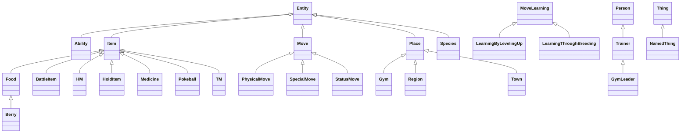

## ERD Diagram

```mermaid
erDiagram
Ability {
    stringList effectDescription  
    string name  
    string description  
    uri id  
}
BattleItem {
    string name  
    string description  
    uri id  
}
Berry {
    string hasSize  
    integer firmness  
    integer smoothness  
    string name  
    string description  
    uri id  
}
Colour {

}
EggGroup {

}
Flavor {

}
Food {
    integer firmness  
    integer smoothness  
    string name  
    string description  
    uri id  
}
Game {

}
Generation {

}
Gym {
    string name  
    string description  
    uri id  
}
GymLeader {

}
HM {
    string name  
    string description  
    uri id  
}
Habitat {

}
HoldItem {
    string name  
    string description  
    uri id  
}
Item {
    string name  
    string description  
    uri id  
}
LearningByLevelingUp {

}
LearningThroughBreeding {

}
Medicine {
    string name  
    string description  
    uri id  
}
Move {
    stringList effectDescription  
    string name  
    string description  
    uri id  
}
MoveLearning {

}
Person {

}
PhysicalMove {
    stringList effectDescription  
    string name  
    string description  
    uri id  
}
Pokeball {
    string name  
    string description  
    uri id  
}
Pokedex {

}
PokedexEntry {

}
Pokemon {

}
Region {
    string name  
    string description  
    uri id  
}
Shape {

}
SpecialMove {
    stringList effectDescription  
    string name  
    string description  
    uri id  
}
Species {
    string hasHeight  
    string hasWeight  
    string depiction  
    string hasGenus  
    integer hasCatchRate  
    string name  
    string description  
    uri id  
}
StatusMove {
    stringList effectDescription  
    string name  
    string description  
    uri id  
}
TM {
    string name  
    string description  
    uri id  
}
Town {
    string name  
    string description  
    uri id  
}
Trainer {

}
Type {

}

Berry ||--}o Flavor : "hasFlavor"
Food ||--}o Flavor : "hasFlavor"
Generation ||--}o Species : "featuresSpecies"
Move ||--}o Type : "hasType"
PhysicalMove ||--}o Type : "hasType"
SpecialMove ||--}o Type : "hasType"
Species ||--|o Shape : "hasShape"
Species ||--}o Ability : "mayHaveAbility"
Species ||--}o Ability : "mayHaveHiddenAbility"
Species ||--}o Colour : "hasColour"
Species ||--}o EggGroup : "inEggGroup"
Species ||--}o Habitat : "foundIn"
Species ||--}o Move : "isAbleToApply"
Species ||--}o Type : "hasType"
StatusMove ||--}o Type : "hasType"

```


## Abstract Classes


### Entity

A grouping of attributes that can be reffered to


#### Local class diagram

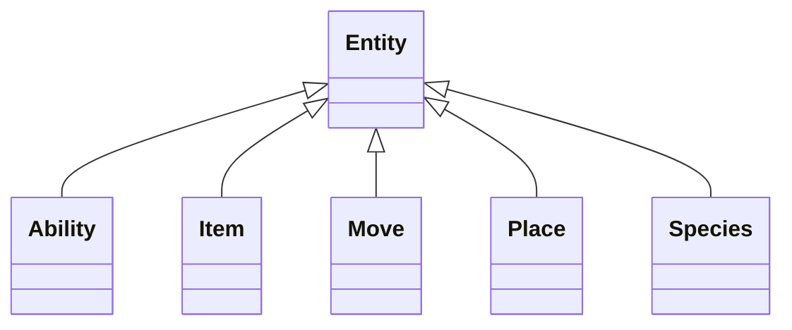

#### Attributes

| Name | Cardinality: | Type | Description |
| --- | --- | --- | --- |
| **id** | <sub>1..1</sub> | uri |  |
| **name** | <sub>0..1</sub> | string | Unique human-readable label for the entity |
| **description** | <sub>0..1</sub> | string | A description of the entity |
| **entity__id** | <sub>1..1</sub> | uri |  |

#### Children

 * [Ability](#Ability)
 * [Item](#Item)
 * [Move](#Move)
 * [Place](#Place)
 * [Species](#Species) - A species is a category of Pokemon that share common features.


### NamedThing

A generic grouping for any identifiable entity that has a name


#### Local class diagram

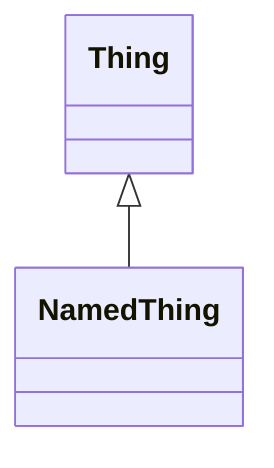

#### Attributes

| Name | Cardinality: | Type | Description |
| --- | --- | --- | --- |
| id | <sub>1..1</sub> | uri | A unique identifier |
| **name** | <sub>0..1</sub> | string | Unique human-readable label for the entity |
| **description** | <sub>0..1</sub> | string | A description of the entity |

#### Parents

 * [Thing](#Thing) - A generic grouping for any identifiable attributes with an id


### Place


#### Local class diagram

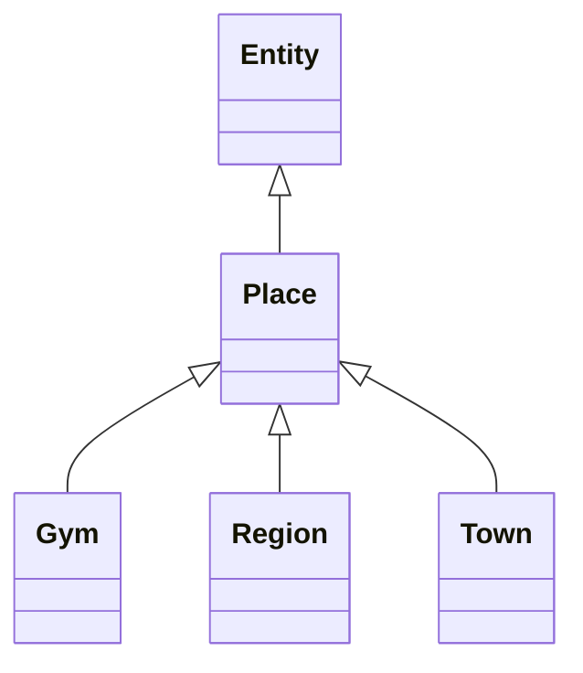

#### Attributes

| Name | Cardinality: | Type | Description |
| --- | --- | --- | --- |
| id | <sub>1..1</sub> | uri |  |
| name | <sub>0..1</sub> | string | Unique human-readable label for the entity |
| description | <sub>0..1</sub> | string | A description of the entity |
| entity__id | <sub>1..1</sub> | uri |  |

#### Parents

 * [Entity](#Entity) - A grouping of attributes that can be reffered to

#### Children

 * [Gym](#Gym) - A gym is a location that can be battled at.
 * [Region](#Region)
 * [Town](#Town) - A town is a type of place that can be visited.

#### Referenced by:


### Thing

A generic grouping for any identifiable attributes with an id


#### Local class diagram


#### Attributes

| Name | Cardinality: | Type | Description |
| --- | --- | --- | --- |
| **id** | <sub>1..1</sub> | uri | A unique identifier |

#### Children

 * [NamedThing](#NamedThing) - A generic grouping for any identifiable entity that has a name


## Classes


### Ability


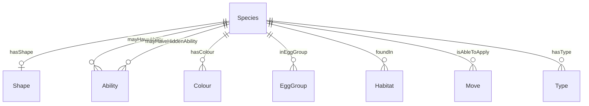


#### Attributes

| Name | Cardinality: | Type | Description |
| --- | --- | --- | --- |
| id | <sub>1..1</sub> | uri |  |
| name | <sub>0..1</sub> | string | Unique human-readable label for the entity |
| description | <sub>0..1</sub> | string | A description of the entity |
| entity__id | <sub>1..1</sub> | uri |  |
| **effectDescription** | <sub>0..\*</sub> | string | A description of the effect of the entity |

#### Parents

 * [Entity](#Entity) - A grouping of attributes that can be reffered to

#### Referenced by:

 *  **[Species](#Species)** : *[mayHaveAbility](#mayHaveAbility)*  <sub>0..\*</sub> 
 *  **[Species](#Species)** : *[mayHaveHiddenAbility](#mayHaveHiddenAbility)*  <sub>0..\*</sub> 


### BattleItem

Battle items are items that can be used during battles.


#### Local class diagram

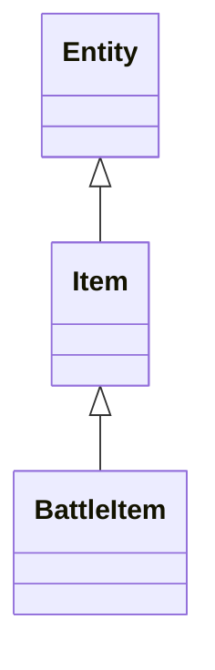

#### Attributes

| Name | Cardinality: | Type | Description |
| --- | --- | --- | --- |
| id | <sub>1..1</sub> | uri |  |
| name | <sub>0..1</sub> | string | Unique human-readable label for the entity |
| description | <sub>0..1</sub> | string | A description of the entity |
| entity__id | <sub>1..1</sub> | uri |  |

#### Parents

 * [Item](#Item)


### Berry


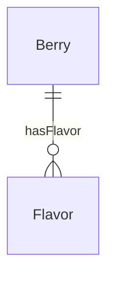


#### Attributes

| Name | Cardinality: | Type | Description |
| --- | --- | --- | --- |
| id | <sub>1..1</sub> | uri |  |
| name | <sub>0..1</sub> | string | Unique human-readable label for the entity |
| description | <sub>0..1</sub> | string | A description of the entity |
| entity__id | <sub>1..1</sub> | uri |  |
| firmness | <sub>0..1</sub> | integer |  |
| hasFlavor | <sub>0..\*</sub> | [Flavor](#Flavor) | ['A Pokemon has a flavor'] |
| smoothness | <sub>0..1</sub> | integer |  |
| **hasSize** | <sub>0..1</sub> | string |  |

#### Parents

 * [Food](#Food)


### Colour

A colour is a visual property of an object


This class has no attributes


#### Referenced by:

 *  **[Species](#Species)** : *[hasColour](#hasColour)*  <sub>0..\*</sub> 


### EggGroup


This class has no attributes


#### Referenced by:

 *  **[Species](#Species)** : *[inEggGroup](#inEggGroup)*  <sub>0..\*</sub> 


### Flavor


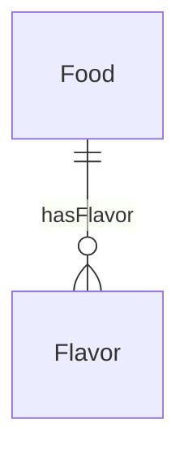


This class has no attributes


#### Referenced by:

 *  **[Food](#Food)** : *[hasFlavor](#hasFlavor)*  <sub>0..\*</sub> 


### Food


#### Attributes

| Name | Cardinality: | Type | Description |
| --- | --- | --- | --- |
| id | <sub>1..1</sub> | uri |  |
| name | <sub>0..1</sub> | string | Unique human-readable label for the entity |
| description | <sub>0..1</sub> | string | A description of the entity |
| entity__id | <sub>1..1</sub> | uri |  |
| **firmness** | <sub>0..1</sub> | integer |  |
| **hasFlavor** | <sub>0..\*</sub> | [Flavor](#Flavor) | ['A Pokemon has a flavor'] |
| **smoothness** | <sub>0..1</sub> | integer |  |

#### Parents

 * [Item](#Item)

#### Children

 * [Berry](#Berry)

#### Referenced by:


### Game

A game is a type of media that can be played by people.


This class has no attributes


### Generation


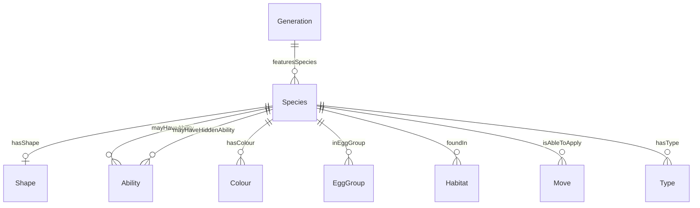


#### Attributes

| Name | Cardinality: | Type | Description |
| --- | --- | --- | --- |
| **featuresSpecies** | <sub>0..\*</sub> | [Species](#Species) | ['A Pokedex entry features a species'] |


### Gym

A gym is a location that can be battled at.


#### Local class diagram

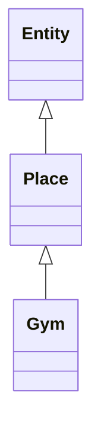

#### Attributes

| Name | Cardinality: | Type | Description |
| --- | --- | --- | --- |
| id | <sub>1..1</sub> | uri |  |
| name | <sub>0..1</sub> | string | Unique human-readable label for the entity |
| description | <sub>0..1</sub> | string | A description of the entity |
| entity__id | <sub>1..1</sub> | uri |  |

#### Parents

 * [Place](#Place)


### GymLeader


#### Local class diagram

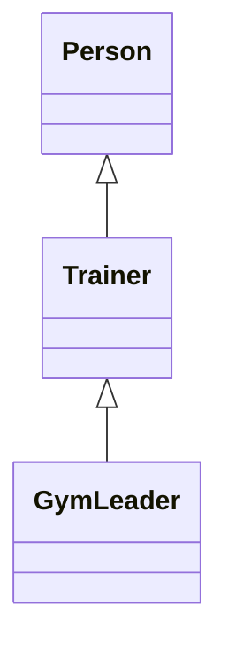

This class has no attributes


#### Parents

 * [Trainer](#Trainer) - A trainer is a person who is able to catch Pokemon.


### HM

Hidden Machine


#### Local class diagram

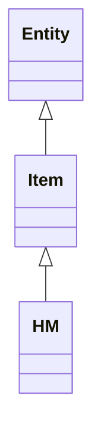

#### Attributes

| Name | Cardinality: | Type | Description |
| --- | --- | --- | --- |
| id | <sub>1..1</sub> | uri |  |
| name | <sub>0..1</sub> | string | Unique human-readable label for the entity |
| description | <sub>0..1</sub> | string | A description of the entity |
| entity__id | <sub>1..1</sub> | uri |  |

#### Parents

 * [Item](#Item)


### Habitat

A habitat is a type of environment that certain Pokemon belong to.


This class has no attributes


#### Referenced by:

 *  **[Species](#Species)** : *[foundIn](#foundIn)*  <sub>0..\*</sub> 


### HoldItem

A hold item is an item that can be held by a Pokemon.


#### Local class diagram

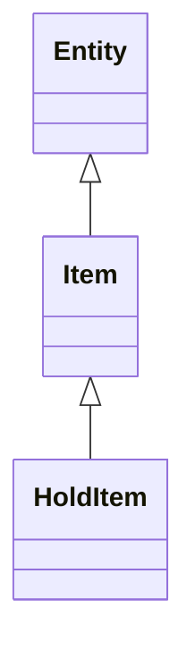

#### Attributes

| Name | Cardinality: | Type | Description |
| --- | --- | --- | --- |
| id | <sub>1..1</sub> | uri |  |
| name | <sub>0..1</sub> | string | Unique human-readable label for the entity |
| description | <sub>0..1</sub> | string | A description of the entity |
| entity__id | <sub>1..1</sub> | uri |  |

#### Parents

 * [Item](#Item)


### Item


#### Local class diagram

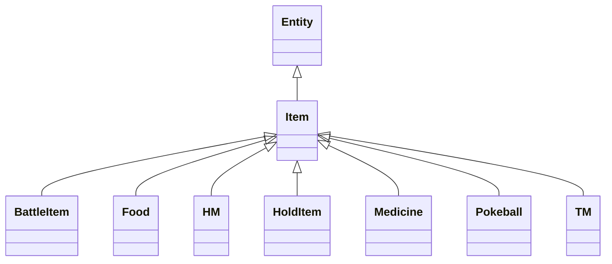

#### Attributes

| Name | Cardinality: | Type | Description |
| --- | --- | --- | --- |
| id | <sub>1..1</sub> | uri |  |
| name | <sub>0..1</sub> | string | Unique human-readable label for the entity |
| description | <sub>0..1</sub> | string | A description of the entity |
| entity__id | <sub>1..1</sub> | uri |  |

#### Parents

 * [Entity](#Entity) - A grouping of attributes that can be reffered to

#### Children

 * [BattleItem](#BattleItem) - Battle items are items that can be used during battles.
 * [Food](#Food)
 * [HM](#HM) - Hidden Machine
 * [HoldItem](#HoldItem) - A hold item is an item that can be held by a Pokemon.
 * [Medicine](#Medicine) - Medicine items can heal various afflictions of a Pokemon.
 * [Pokeball](#Pokeball)
 * [TM](#TM)


### LearningByLevelingUp

A move that is learned by leveling up.


#### Local class diagram

```mermaid
classDiagram
MoveLearning <|-- LearningByLevelingUp

```

This class has no attributes


#### Parents

 * [MoveLearning](#MoveLearning) - A move learning is a way that a Pokemon can learn a move.


### LearningThroughBreeding

A move that is learned by breeding.


#### Local class diagram

```mermaid
classDiagram
MoveLearning <|-- LearningThroughBreeding

```

This class has no attributes


#### Parents

 * [MoveLearning](#MoveLearning) - A move learning is a way that a Pokemon can learn a move.


### Medicine

Medicine items can heal various afflictions of a Pokemon.


#### Local class diagram

```mermaid
classDiagram
Entity <|-- Item
Item <|-- Medicine

```

#### Attributes

| Name | Cardinality: | Type | Description |
| --- | --- | --- | --- |
| id | <sub>1..1</sub> | uri |  |
| name | <sub>0..1</sub> | string | Unique human-readable label for the entity |
| description | <sub>0..1</sub> | string | A description of the entity |
| entity__id | <sub>1..1</sub> | uri |  |

#### Parents

 * [Item](#Item)


### Move


```mermaid
erDiagram
Move {

}
Species {

}
Type {

}

Move ||--}o Type : "hasType"
Species ||--|o Shape : "hasShape"
Species ||--}o Ability : "mayHaveAbility"
Species ||--}o Ability : "mayHaveHiddenAbility"
Species ||--}o Colour : "hasColour"
Species ||--}o EggGroup : "inEggGroup"
Species ||--}o Habitat : "foundIn"
Species ||--}o Move : "isAbleToApply"
Species ||--}o Type : "hasType"

```


#### Attributes

| Name | Cardinality: | Type | Description |
| --- | --- | --- | --- |
| id | <sub>1..1</sub> | uri |  |
| name | <sub>0..1</sub> | string | Unique human-readable label for the entity |
| description | <sub>0..1</sub> | string | A description of the entity |
| entity__id | <sub>1..1</sub> | uri |  |
| **effectDescription** | <sub>0..\*</sub> | string | A description of the effect of the entity |
| **hasType** | <sub>0..\*</sub> | [Type](#Type) | ['A Pokemon has a type'] |

#### Parents

 * [Entity](#Entity) - A grouping of attributes that can be reffered to

#### Children

 * [PhysicalMove](#PhysicalMove) - A physical move is a type of move that can be used during battles.
 * [SpecialMove](#SpecialMove) - A special move is a type of move that can be used during battles.
 * [StatusMove](#StatusMove) - A status move is a type of move that can be used during battles.

#### Referenced by:

 *  **[Species](#Species)** : *[isAbleToApply](#isAbleToApply)*  <sub>0..\*</sub> 


### MoveLearning

A move learning is a way that a Pokemon can learn a move.


#### Local class diagram

```mermaid
classDiagram
MoveLearning <|-- LearningByLevelingUp
MoveLearning <|-- LearningThroughBreeding

```

This class has no attributes


#### Children

 * [LearningByLevelingUp](#LearningByLevelingUp) - A move that is learned by leveling up.
 * [LearningThroughBreeding](#LearningThroughBreeding) - A move that is learned by breeding.

#### Used as mixin by

 * [TM](#TM)

#### Referenced by:


### Person

A person is a human being


#### Local class diagram

```mermaid
classDiagram
Person <|-- Trainer

```

This class has no attributes


#### Children

 * [Trainer](#Trainer) - A trainer is a person who is able to catch Pokemon.


### PhysicalMove

A physical move is a type of move that can be used during battles.

```mermaid
erDiagram
PhysicalMove {

}
Type {

}

PhysicalMove ||--}o Type : "hasType"

```


#### Attributes

| Name | Cardinality: | Type | Description |
| --- | --- | --- | --- |
| id | <sub>1..1</sub> | uri |  |
| name | <sub>0..1</sub> | string | Unique human-readable label for the entity |
| description | <sub>0..1</sub> | string | A description of the entity |
| effectDescription | <sub>0..\*</sub> | string | A description of the effect of the entity |
| entity__id | <sub>1..1</sub> | uri |  |
| hasType | <sub>0..\*</sub> | [Type](#Type) | ['A Pokemon has a type'] |

#### Parents

 * [Move](#Move)


### Pokeball


#### Local class diagram

```mermaid
classDiagram
Entity <|-- Item
Item <|-- Pokeball

```

#### Attributes

| Name | Cardinality: | Type | Description |
| --- | --- | --- | --- |
| id | <sub>1..1</sub> | uri |  |
| name | <sub>0..1</sub> | string | Unique human-readable label for the entity |
| description | <sub>0..1</sub> | string | A description of the entity |
| entity__id | <sub>1..1</sub> | uri |  |

#### Parents

 * [Item](#Item)


### Pokedex


This class has no attributes


#### Referenced by:


### PokedexEntry

A pokedex entry is a description of a Pokemon.


This class has no attributes


#### Referenced by:


### Pokemon

A Pokemon


This class has no attributes


### Region


#### Local class diagram

```mermaid
classDiagram
Entity <|-- Place
Place <|-- Region

```

#### Attributes

| Name | Cardinality: | Type | Description |
| --- | --- | --- | --- |
| id | <sub>1..1</sub> | uri |  |
| name | <sub>0..1</sub> | string | Unique human-readable label for the entity |
| description | <sub>0..1</sub> | string | A description of the entity |
| entity__id | <sub>1..1</sub> | uri |  |

#### Parents

 * [Place](#Place)


### Shape

Shapes are categories that certain Pokemon belong to, which determine which Pokemon they can breed with.

```mermaid
erDiagram
Shape {

}
Species {

}

Species ||--|o Shape : "hasShape"
Species ||--}o Ability : "mayHaveAbility"
Species ||--}o Ability : "mayHaveHiddenAbility"
Species ||--}o Colour : "hasColour"
Species ||--}o EggGroup : "inEggGroup"
Species ||--}o Habitat : "foundIn"
Species ||--}o Move : "isAbleToApply"
Species ||--}o Type : "hasType"

```


This class has no attributes


#### Referenced by:

 *  **[Species](#Species)** : *[hasShape](#hasShape)*  <sub>0..1</sub> 


### SpecialMove

A special move is a type of move that can be used during battles.

```mermaid
erDiagram
SpecialMove {

}
Type {

}

SpecialMove ||--}o Type : "hasType"

```


#### Attributes

| Name | Cardinality: | Type | Description |
| --- | --- | --- | --- |
| id | <sub>1..1</sub> | uri |  |
| name | <sub>0..1</sub> | string | Unique human-readable label for the entity |
| description | <sub>0..1</sub> | string | A description of the entity |
| effectDescription | <sub>0..\*</sub> | string | A description of the effect of the entity |
| entity__id | <sub>1..1</sub> | uri |  |
| hasType | <sub>0..\*</sub> | [Type](#Type) | ['A Pokemon has a type'] |

#### Parents

 * [Move](#Move)


### Species

A species is a category of Pokemon that share common features.

```mermaid
erDiagram
Ability {

}
Colour {

}
EggGroup {

}
Generation {

}
Habitat {

}
Move {

}
Shape {

}
Species {

}
Type {

}

Generation ||--}o Species : "featuresSpecies"
Move ||--}o Type : "hasType"
Species ||--|o Shape : "hasShape"
Species ||--}o Ability : "mayHaveAbility"
Species ||--}o Ability : "mayHaveHiddenAbility"
Species ||--}o Colour : "hasColour"
Species ||--}o EggGroup : "inEggGroup"
Species ||--}o Habitat : "foundIn"
Species ||--}o Move : "isAbleToApply"
Species ||--}o Type : "hasType"

```


#### Attributes

| Name | Cardinality: | Type | Description |
| --- | --- | --- | --- |
| id | <sub>1..1</sub> | uri |  |
| name | <sub>0..1</sub> | string | Unique human-readable label for the entity |
| description | <sub>0..1</sub> | string | A description of the entity |
| entity__id | <sub>1..1</sub> | uri |  |
| **depiction** | <sub>0..1</sub> | string | A depiction of the person |
| **foundIn** | <sub>0..\*</sub> | [Habitat](#Habitat) | ['A place is found in a location'] |
| **hasCatchRate** | <sub>0..1</sub> | integer |  |
| **hasColour** | <sub>0..\*</sub> | [Colour](#Colour) | ['A Pokemon has a color'] |
| **hasGenus** | <sub>0..1</sub> | string |  |
| **hasHeight** | <sub>0..1</sub> | string |  |
| **hasShape** | <sub>0..1</sub> | [Shape](#Shape) | The shape of a berry is a measure of how good it is for making a Potion. |
| **hasType** | <sub>0..\*</sub> | [Type](#Type) | ['A Pokemon has a type'] |
| **hasWeight** | <sub>0..1</sub> | string |  |
| **inEggGroup** | <sub>0..\*</sub> | [EggGroup](#EggGroup) |  |
| **isAbleToApply** | <sub>0..\*</sub> | [Move](#Move) |  |
| **mayHaveAbility** | <sub>0..\*</sub> | [Ability](#Ability) | ['A Pokemon may have an ability'] |
| **mayHaveHiddenAbility** | <sub>0..\*</sub> | [Ability](#Ability) |  |

#### Parents

 * [Entity](#Entity) - A grouping of attributes that can be reffered to

#### Referenced by:

 *  **[Generation](#Generation)** : *[featuresSpecies](#featuresSpecies)*  <sub>0..\*</sub> 


### StatusMove

A status move is a type of move that can be used during battles.

```mermaid
erDiagram
StatusMove {

}
Type {

}

StatusMove ||--}o Type : "hasType"

```


#### Attributes

| Name | Cardinality: | Type | Description |
| --- | --- | --- | --- |
| id | <sub>1..1</sub> | uri |  |
| name | <sub>0..1</sub> | string | Unique human-readable label for the entity |
| description | <sub>0..1</sub> | string | A description of the entity |
| effectDescription | <sub>0..\*</sub> | string | A description of the effect of the entity |
| entity__id | <sub>1..1</sub> | uri |  |
| hasType | <sub>0..\*</sub> | [Type](#Type) | ['A Pokemon has a type'] |

#### Parents

 * [Move](#Move)


### TM


#### Local class diagram

```mermaid
classDiagram
Entity <|-- Item
Item <|-- TM
TM ..> MoveLearning

```

#### Attributes

| Name | Cardinality: | Type | Description |
| --- | --- | --- | --- |
| id | <sub>1..1</sub> | uri |  |
| name | <sub>0..1</sub> | string | Unique human-readable label for the entity |
| description | <sub>0..1</sub> | string | A description of the entity |
| entity__id | <sub>1..1</sub> | uri |  |

#### Parents

 * [Item](#Item)

#### Uses

 *  mixin: [MoveLearning](#MoveLearning) - A move learning is a way that a Pokemon can learn a move.


### Town

A town is a type of place that can be visited.


#### Local class diagram

```mermaid
classDiagram
Entity <|-- Place
Place <|-- Town

```

#### Attributes

| Name | Cardinality: | Type | Description |
| --- | --- | --- | --- |
| id | <sub>1..1</sub> | uri |  |
| name | <sub>0..1</sub> | string | Unique human-readable label for the entity |
| description | <sub>0..1</sub> | string | A description of the entity |
| entity__id | <sub>1..1</sub> | uri |  |

#### Parents

 * [Place](#Place)


### Trainer

A trainer is a person who is able to catch Pokemon.


#### Local class diagram

```mermaid
classDiagram
Person <|-- Trainer
Trainer <|-- GymLeader

```

This class has no attributes


#### Parents

 * [Person](#Person) - A person is a human being

#### Children

 * [GymLeader](#GymLeader)


### Type


```mermaid
erDiagram
Move {

}
Species {

}
Type {

}

Move ||--}o Type : "hasType"
Species ||--|o Shape : "hasShape"
Species ||--}o Ability : "mayHaveAbility"
Species ||--}o Ability : "mayHaveHiddenAbility"
Species ||--}o Colour : "hasColour"
Species ||--}o EggGroup : "inEggGroup"
Species ||--}o Habitat : "foundIn"
Species ||--}o Move : "isAbleToApply"
Species ||--}o Type : "hasType"

```


This class has no attributes


#### Referenced by:

 *  **[Move](#Move)** : *[hasType](#hasType)*  <sub>0..\*</sub> 
 *  **[Species](#Species)** : *[hasType](#hasType)*  <sub>0..\*</sub> 


## Enums


### HabitatEnum


| Text | Meaning: | Description |
| --- | --- | --- |
| Cave | pokemon:Habitat_Cave |  |
| Forest | pokemon:Habitat_Forest |  |
| Grassland | pokemon:Habitat_Grassland |  |

