# LINKML-POKEMON


**metamodel version:** 1.7.0

**version:** None


Ontology covering the Pokémon world as it is presented in games and anime television series


## Class Diagram


## ERD Diagram

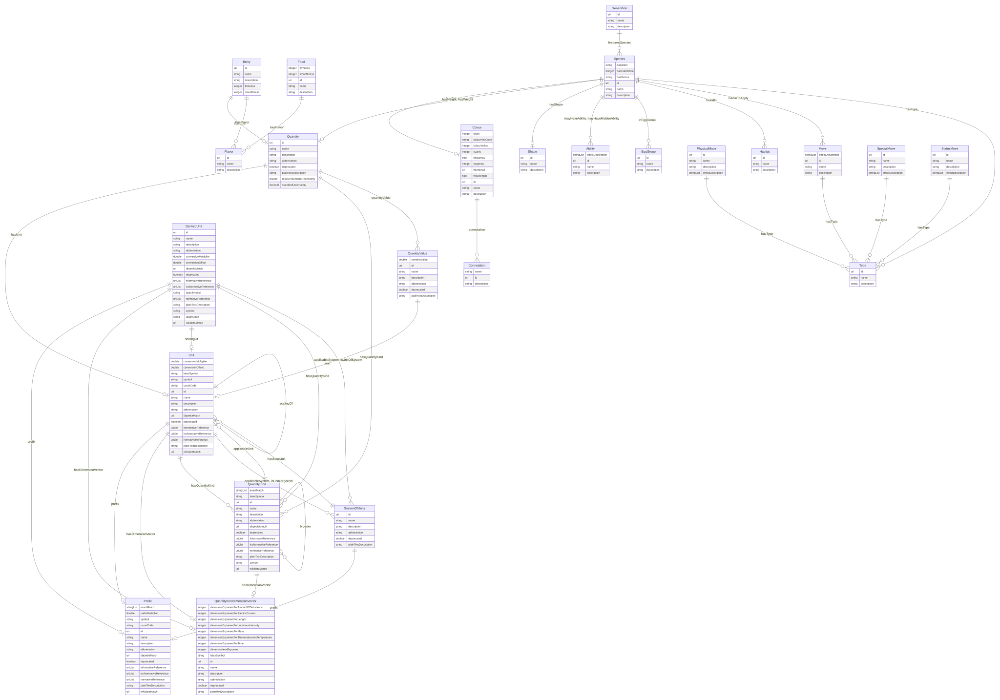

## Base Classes


Foundational classes in the hierarchy (root classes and direct children of Thing):

| Class | Description |
| --- | --- |
| [Ability](#ability) | Abilities were introduced in Generation III as an all new game mechanic. Each and every Pokémon has an ability, and can only have one at a time. Some abilities are exclusive to certain Pokémon and Evolution lines, while others are known by many Pokémon. |
| [Aspect](#aspect) | An abstract type class that defines properties that can be reused |
| [Color](#color) | Color is the visual perceptual property corresponding in humans to the categories called red, yellow, blue and others. |
| [Concept](#concept) | The root class for all QUDT concepts |
| [Connotation](#connotation) | Cultural or symbolic meaning associated with a color. Imported from DBpedia as generic owl:Thing resources. |
| [Game](#game) | A game is a type of media that can be played by people. |
| [Generation](#generation) | Generations refers to the Pokémon game series. It is a group of games that were released at or around the same time. It also means that games in the same generation are compatible with the others, containing the same Pokémon and the number of moves there are to be learned. |
| [Item](#item) | An item is an object in the Pokémon games which the player can pick up, keep in their Bag, and use in some manner. They have various uses, including healing, powering up, helping one to catch Pokémon, or to access a new area. |
| [Move](#move) | A move is a special ability of a Pokémon. |
| [MoveLearning](#movelearning) | A move learning is a way that a Pokémon can learn a move. |
| [NamedIndividual](#namedindividual) | A Thing that requires a name |
| [Place](#place) | Entities that have a somewhat fixed, physical extension. |
| [Pokedex](#pokedex) | The Pokédex is an electronic device designed to catalog and provide information regarding the various species of Pokémon featured in the Pokémon video game, anime and manga series. |
| [PokedexEntry](#pokedexentry) | A Pokédex entry is a description of a Pokémon. |
| [Thing](#thing) | An rdfs:Resource that defines name and description |

## Standalone Classes


These classes are completely isolated with no relationships and are not used as base classes:

| Class | Description |
| --- | --- |
| [BattleItem](#battleitem) | Battle items are items that can be used during battles. |
| [DecimalPrefix](#decimalprefix) | Decimal prefix (powers of 10) |
| [Gym](#gym) | A gym is a location that can be battled at. |
| [GymLeader](#gymleader) | A gym leader is the highest ranking member and owner of an official Pokémon gym. Gym leaders use their gym and their Pokémon to test the skills of trainers that challenge them, and if said trainers win a battle, the gym leader will gift them a badge that's unique to that specific gym. |
| [HM](#hm) | Hidden Machine |
| [HoldItem](#holditem) | A hold item is an item that can be held by a Pokémon. |
| [LearningByLevelingUp](#learningbylevelingup) | A move that is learned by leveling up. |
| [LearningThroughBreeding](#learningthroughbreeding) | A move that is learned by breeding. |
| [Medicine](#medicine) | Medicine items can heal various afflictions of a Pokémon. |
| [Person](#person) | A person is a human being |
| [Pokeball](#pokeball) | A Poké Ball is a type of item that is critical to a Trainer's quest, used for catching and storing Pokémon. |
| [Pokemon](#pokemon) | A Pokémon |
| [QuantityKindDimensionVectorCGS](#quantitykinddimensionvectorcgs) | CGS dimension vector |
| [QuantityKindDimensionVectorISO](#quantitykinddimensionvectoriso) | ISO dimension vector |
| [QuantityKindDimensionVectorImperial](#quantitykinddimensionvectorimperial) | Imperial dimension vector |
| [QuantityKindDimensionVectorSI](#quantitykinddimensionvectorsi) | SI dimension vector |
| [Region](#region) | Regions are areas in the Pokémon universe that are smaller parts of a nation. |
| [TM](#tm) | A Technical Machine is an item that can be used to teach a Pokémon a move. |
| [Town](#town) | A town is a type of place that can be visited. |
| [Trainer](#trainer) | A trainer is a person who is able to catch Pokémon. |

## Abstract Classes


### AbstractQuantityKind

Abstract base for quantity kinds, constraining symbol and broader


#### YAML Definition

<details>
<summary>Click to expand</summary>

```yaml
AbstractQuantityKind:
  is_a: Concept
  abstract: true
  description: Abstract base for quantity kinds, constraining symbol and broader
  slots:
  - id
  - name
  - description
  - abbreviation
  - deprecated
  - plainTextDescription
  - symbol
  - broader

```
</details>

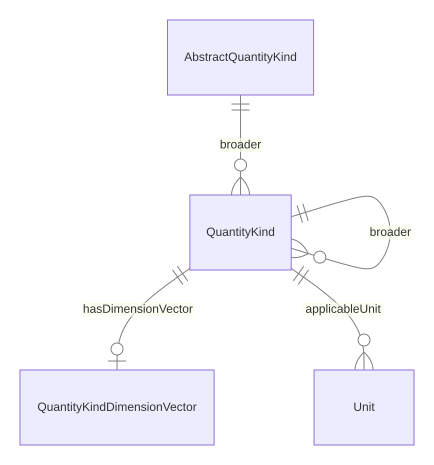

#### Attributes

| Name | Cardinality: | Type | Description |
| --- | --- | --- | --- |
| **[id](#id)** | <sub>1..1</sub> | uri | A unique identifier |
| **[name](#name)** | <sub>0..1</sub> | string | Human-readable label for the entity |
| **[description](#description)** | <sub>0..1</sub> | string | A description of the entity |
| **[abbreviation](#abbreviation)** | <sub>0..1</sub> | string | Short alphanumeric abbreviation for a unit |
| **[deprecated](#deprecated)** | <sub>0..1</sub> | boolean | Whether this entity is deprecated |
| **[plainTextDescription](#plaintextdescription)** | <sub>0..1</sub> | string | Plain text description |
| **[broader](#broader)** | <sub>0..\*</sub> | [QuantityKind](#quantitykind) | Broader/parent quantity kind |
| **[symbol](#symbol)** | <sub>0..1</sub> | string | Symbol for a unit (e.g., "m" for meter) |

#### Parents

 * [Concept](#concept) - The root class for all QUDT concepts

#### Children

 * [QuantityKind](#quantitykind) - Kind of quantity (e.g., Length, Mass, Height, Weight)


### Concept

The root class for all QUDT concepts


#### YAML Definition

<details>
<summary>Click to expand</summary>

```yaml
Concept:
  is_a: Thing
  abstract: true
  description: The root class for all QUDT concepts
  slots:
  - id
  - name
  - description
  - abbreviation
  - deprecated
  - plainTextDescription

```
</details>


#### Local class diagram


#### Attributes

| Name | Cardinality: | Type | Description |
| --- | --- | --- | --- |
| **[id](#id)** | <sub>1..1</sub> | uri | A unique identifier |
| **[name](#name)** | <sub>0..1</sub> | string | Human-readable label for the entity |
| **[description](#description)** | <sub>0..1</sub> | string | A description of the entity |
| **[abbreviation](#abbreviation)** | <sub>0..1</sub> | string | Short alphanumeric abbreviation for a unit |
| **[deprecated](#deprecated)** | <sub>0..1</sub> | boolean | Whether this entity is deprecated |
| **[plainTextDescription](#plaintextdescription)** | <sub>0..1</sub> | string | Plain text description |

#### Parents

 * [Thing](#thing) - An rdfs:Resource that defines name and description

#### Children

 * [AbstractQuantityKind](#abstractquantitykind) - Abstract base for quantity kinds, constraining symbol and broader
 * [Prefix](#prefix) - Unit prefix (e.g., Kilo, Milli)
 * [Quantity](#quantity) - A measured quantity with kind and value
 * [QuantityKindDimensionVector](#quantitykinddimensionvector) - Dimension vector expressing quantity in base dimensions
 * [QuantityValue](#quantityvalue) - Numeric value with unit
 * [SystemOfUnits](#systemofunits) - A coherent system of units (e.g., SI, CGS)
 * [Unit](#unit) - Unit of measurement


### NamedIndividual

A Thing that requires a name


#### YAML Definition

<details>
<summary>Click to expand</summary>

```yaml
NamedIndividual:
  is_a: Thing
  abstract: true
  description: A Thing that requires a name
  slots:
  - id
  - description
  - NamedIndividual_name
  slot_usage:
    name:
      required: true

```
</details>


#### Local class diagram


#### Attributes

| Name | Cardinality: | Type | Description |
| --- | --- | --- | --- |
| **[id](#id)** | <sub>1..1</sub> | uri | A unique identifier |
| **[name](#name)** | <sub>1..1</sub> | string | Human-readable label for the entity |
| **[description](#description)** | <sub>0..1</sub> | string | A description of the entity |

#### Parents

 * [Thing](#thing) - An rdfs:Resource that defines name and description

#### Children

 * [EggGroup](#egggroup) - Egg group is a category that determines which Pokémon are able to interbreed. The concept was introduced in Generation II, along with breeding. Similar to types, a Pokémon may belong to either one or two egg groups.
 * [Flavor](#flavor) - Flavor is a special set of attributes that certain foods in the Pokémon world have. Most of the foods can have more than one flavor, and the flavor determines which Pokémon can eat them.
 * [Habitat](#habitat) - A habitat is a type of environment that certain Pokémon belong to.
 * [Person](#person) - A person is a human being
 * [Shape](#shape) - Shapes are categories that certain Pokémon belong to, which determine which Pokémon they can breed with.
 * [Species](#species) - A species is a category of Pokémon that share common features.
 * [Type](#type) - All Pokémon creatures and their moves are assigned certain types. Each type has several strengths and weaknesses in both attack and defense.


### Place

Entities that have a somewhat fixed, physical extension.


#### YAML Definition

<details>
<summary>Click to expand</summary>

```yaml
Place:
  is_a: Thing
  abstract: true
  description: Entities that have a somewhat fixed, physical extension.
  slots:
  - id
  - name
  - description

```
</details>


#### Local class diagram


#### Attributes

| Name | Cardinality: | Type | Description |
| --- | --- | --- | --- |
| **[id](#id)** | <sub>1..1</sub> | uri | A unique identifier |
| **[name](#name)** | <sub>0..1</sub> | string | Human-readable label for the entity |
| **[description](#description)** | <sub>0..1</sub> | string | A description of the entity |

#### Parents

 * [Thing](#thing) - An rdfs:Resource that defines name and description

#### Children

 * [Gym](#gym) - A gym is a location that can be battled at.
 * [Region](#region) - Regions are areas in the Pokémon universe that are smaller parts of a nation.
 * [Town](#town) - A town is a type of place that can be visited.

#### Referenced by:


### Thing

An rdfs:Resource that defines name and description


#### YAML Definition

<details>
<summary>Click to expand</summary>

```yaml
Thing:
  abstract: true
  description: An rdfs:Resource that defines name and description
  slots:
  - id
  - name
  - description

```
</details>


#### Local class diagram


#### Attributes

| Name | Cardinality: | Type | Description |
| --- | --- | --- | --- |
| **[id](#id)** | <sub>1..1</sub> | uri | A unique identifier |
| **[name](#name)** | <sub>0..1</sub> | string | Human-readable label for the entity |
| **[description](#description)** | <sub>0..1</sub> | string | A description of the entity |

#### Children

 * [Ability](#ability) - Abilities were introduced in Generation III as an all new game mechanic. Each and every Pokémon has an ability, and can only have one at a time. Some abilities are exclusive to certain Pokémon and Evolution lines, while others are known by many Pokémon.
 * [Color](#color) - Color is the visual perceptual property corresponding in humans to the categories called red, yellow, blue and others.
 * [Concept](#concept) - The root class for all QUDT concepts
 * [Connotation](#connotation) - Cultural or symbolic meaning associated with a color. Imported from DBpedia as generic owl:Thing resources.
 * [Game](#game) - A game is a type of media that can be played by people.
 * [Generation](#generation) - Generations refers to the Pokémon game series. It is a group of games that were released at or around the same time. It also means that games in the same generation are compatible with the others, containing the same Pokémon and the number of moves there are to be learned.
 * [Item](#item) - An item is an object in the Pokémon games which the player can pick up, keep in their Bag, and use in some manner. They have various uses, including healing, powering up, helping one to catch Pokémon, or to access a new area.
 * [Move](#move) - A move is a special ability of a Pokémon.
 * [NamedIndividual](#namedindividual) - A Thing that requires a name
 * [Place](#place) - Entities that have a somewhat fixed, physical extension.
 * [Pokedex](#pokedex) - The Pokédex is an electronic device designed to catalog and provide information regarding the various species of Pokémon featured in the Pokémon video game, anime and manga series.
 * [PokedexEntry](#pokedexentry) - A Pokédex entry is a description of a Pokémon.


## Classes


### Ability

Abilities were introduced in Generation III as an all new game mechanic. Each and every Pokémon has an ability, and can only have one at a time. Some abilities are exclusive to certain Pokémon and Evolution lines, while others are known by many Pokémon.


#### YAML Definition

<details>
<summary>Click to expand</summary>

```yaml
Ability:
  is_a: Thing
  description: "Abilities were introduced in Generation III as an all new game mechanic.\
    \ Each and every Pok\xE9mon has an ability, and can only have one at a time. Some\
    \ abilities are exclusive to certain Pok\xE9mon and Evolution lines, while others\
    \ are known by many Pok\xE9mon."
  slots:
  - id
  - name
  - description
  - effectDescription

```
</details>


#### Attributes

| Name | Cardinality: | Type | Description |
| --- | --- | --- | --- |
| **[id](#id)** | <sub>1..1</sub> | uri | A unique identifier |
| **[name](#name)** | <sub>0..1</sub> | string | Human-readable label for the entity |
| **[description](#description)** | <sub>0..1</sub> | string | A description of the entity |
| **[effectDescription](#effectdescription)** | <sub>0..\*</sub> | string | A description of the effect of the entity |

#### Parents

 * [Thing](#thing) - An rdfs:Resource that defines name and description

#### Referenced by:

 *  **[Species](#species)** : mayHaveAbility  <sub>0..\*</sub> 
 *  **[Species](#species)** : mayHaveHiddenAbility  <sub>0..\*</sub> 


### BattleItem

Battle items are items that can be used during battles.


#### YAML Definition

<details>
<summary>Click to expand</summary>

```yaml
BattleItem:
  is_a: Item
  description: Battle items are items that can be used during battles.
  slots:
  - id
  - name
  - description

```
</details>


#### Local class diagram


#### Attributes

| Name | Cardinality: | Type | Description |
| --- | --- | --- | --- |
| **[id](#id)** | <sub>1..1</sub> | uri | A unique identifier |
| **[name](#name)** | <sub>0..1</sub> | string | Human-readable label for the entity |
| **[description](#description)** | <sub>0..1</sub> | string | A description of the entity |

#### Parents

 * [Item](#item) - An item is an object in the Pokémon games which the player can pick up, keep in their Bag, and use in some manner. They have various uses, including healing, powering up, helping one to catch Pokémon, or to access a new area.


### Berry

Berries are small, juicy, fleshy fruit. As in the real world, a large variety exists in the Pokémon world, with a large range of flavors, names, and effects. First found in the Generation II games, many Berries have since became critical help items in battle, where their various effects include HP and status condition restoration, stat enhancement, and even damage negation.


#### YAML Definition

<details>
<summary>Click to expand</summary>

```yaml
Berry:
  is_a: Food
  description: "Berries are small, juicy, fleshy fruit. As in the real world, a large\
    \ variety exists in the Pok\xE9mon world, with a large range of flavors, names,\
    \ and effects. First found in the Generation II games, many Berries have since\
    \ became critical help items in battle, where their various effects include HP\
    \ and status condition restoration, stat enhancement, and even damage negation."
  slots:
  - id
  - name
  - description
  - hasFlavor
  - firmness
  - smoothness
  - hasSize

```
</details>

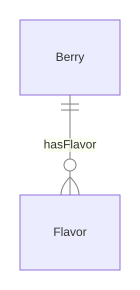

#### Attributes

| Name | Cardinality: | Type | Description |
| --- | --- | --- | --- |
| **[id](#id)** | <sub>1..1</sub> | uri | A unique identifier |
| **[name](#name)** | <sub>0..1</sub> | string | Human-readable label for the entity |
| **[description](#description)** | <sub>0..1</sub> | string | A description of the entity |
| **[firmness](#firmness)** | <sub>0..1</sub> | integer | How firm a berry or food item feels, affecting its use in Pokéblock or Poffin making. |
| **[hasFlavor](#hasflavor)** | <sub>0..\*</sub> | [Flavor](#flavor) | A Pokémon has a flavor |
| **[smoothness](#smoothness)** | <sub>0..1</sub> | integer | How smooth a berry or food item is, affecting its use in Pokéblock or Poffin making. |
| **[hasSize](#hassize)** | <sub>0..1</sub> | [Quantity](#quantity) | The physical size of an entity, expressed as a quantity with unit. |

#### Parents

 * [Food](#food) - Food items are consumable items in the Pokémon world that can have flavors, firmness, and smoothness attributes.


### Color

Color is the visual perceptual property corresponding in humans to the categories called red, yellow, blue and others.


#### YAML Definition

<details>
<summary>Click to expand</summary>

```yaml
Color:
  is_a: Thing
  mixins:
  - CmykColor
  description: Color is the visual perceptual property corresponding in humans to
    the categories called red, yellow, blue and others.
  slots:
  - id
  - name
  - description
  - wavelength
  - frequency
  - colorHexCode
  - connotation
  - thumbnail
  - cmykC
  - cmykM
  - cmykY
  - cmykK

```
</details>


#### Attributes

| Name | Cardinality: | Type | Description |
| --- | --- | --- | --- |
| **[id](#id)** | <sub>1..1</sub> | uri | A unique identifier |
| **[name](#name)** | <sub>0..1</sub> | string | Human-readable label for the entity |
| **[description](#description)** | <sub>0..1</sub> | string | A description of the entity |
| **[cmykC](#cmykc)** | <sub>0..1</sub> | integer | Cyan component in CMYK color model (0-100) |
| **[cmykK](#cmykk)** | <sub>0..1</sub> | integer | Black (K) component in CMYK color model (0-100) |
| **[cmykM](#cmykm)** | <sub>0..1</sub> | integer | Magenta component in CMYK color model (0-100) |
| **[cmykY](#cmyky)** | <sub>0..1</sub> | integer | Yellow component in CMYK color model (0-100) |
| **[colorHexCode](#colorhexcode)** | <sub>0..1</sub> | string | Hexadecimal RGB color code (e.g., "0000FF" for blue) |
| **[connotation](#connotation)** | <sub>0..\*</sub> | [Connotation](#connotation) | Cultural or symbolic meanings associated with this color |
| **[frequency](#frequency)** | <sub>0..1</sub> | float | The frequency of the color in Hz |
| **[thumbnail](#thumbnail)** | <sub>0..1</sub> | uri | URL to a representative image of this color |
| **[wavelength](#wavelength)** | <sub>0..1</sub> | float | The wavelength of the color in meters (e.g., 4.5e-07 for blue) |

#### Parents

 * [Thing](#thing) - An rdfs:Resource that defines name and description

#### Uses

 *  mixin: [CmykColor](#cmykcolor) - CMYK color space coordinates (0-100).

#### Referenced by:

 *  **[Species](#species)** : hasColor  <sub>0..1</sub> 


### Connotation

Cultural or symbolic meaning associated with a color. Imported from DBpedia as generic owl:Thing resources.


#### YAML Definition

<details>
<summary>Click to expand</summary>

```yaml
Connotation:
  is_a: Thing
  description: Cultural or symbolic meaning associated with a color. Imported from
    DBpedia as generic owl:Thing resources.
  slots:
  - id
  - description
  - Connotation_name
  slot_usage:
    name:
      required: true

```
</details>

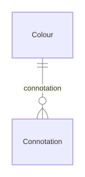

#### Attributes

| Name | Cardinality: | Type | Description |
| --- | --- | --- | --- |
| **[id](#id)** | <sub>1..1</sub> | uri | A unique identifier |
| **[name](#name)** | <sub>1..1</sub> | string | Human-readable label for the entity |
| **[description](#description)** | <sub>0..1</sub> | string | A description of the entity |

#### Parents

 * [Thing](#thing) - An rdfs:Resource that defines name and description

#### Referenced by:

 *  **[Color](#color)** : connotation  <sub>0..\*</sub> 


### DecimalPrefix

Decimal prefix (powers of 10)


#### YAML Definition

<details>
<summary>Click to expand</summary>

```yaml
DecimalPrefix:
  is_a: Prefix
  description: Decimal prefix (powers of 10)
  slots:
  - id
  - name
  - description
  - abbreviation
  - deprecated
  - plainTextDescription
  - symbol
  - prefixMultiplier
  - ucumCode
  - exactMatch
  - dbpediaMatch
  - wikidataMatch
  - informativeReference
  - isoNormativeReference
  - normativeReference

```
</details>


#### Local class diagram


#### Attributes

| Name | Cardinality: | Type | Description |
| --- | --- | --- | --- |
| **[id](#id)** | <sub>1..1</sub> | uri | A unique identifier |
| **[name](#name)** | <sub>0..1</sub> | string | Human-readable label for the entity |
| **[description](#description)** | <sub>0..1</sub> | string | A description of the entity |
| **[abbreviation](#abbreviation)** | <sub>0..1</sub> | string | Short alphanumeric abbreviation for a unit |
| **[deprecated](#deprecated)** | <sub>0..1</sub> | boolean | Whether this entity is deprecated |
| **[exactMatch](#exactmatch)** | <sub>0..\*</sub> | string | Equivalent quantity kind or unit |
| **[plainTextDescription](#plaintextdescription)** | <sub>0..1</sub> | string | Plain text description |
| **[prefixMultiplier](#prefixmultiplier)** | <sub>0..1</sub> | double | Numeric multiplier for the prefix (e.g., 1000 for Kilo) |
| **[symbol](#symbol)** | <sub>0..1</sub> | string | Symbol for a unit (e.g., "m" for meter) |
| **[ucumCode](#ucumcode)** | <sub>0..1</sub> | string | UCUM code for the unit |
| **[dbpediaMatch](#dbpediamatch)** | <sub>0..1</sub> | uri | DBpedia URI for this entity |
| **[informativeReference](#informativereference)** | <sub>0..\*</sub> | uri | Informative reference URL |
| **[isoNormativeReference](#isonormativereference)** | <sub>0..\*</sub> | uri | ISO normative reference URI |
| **[normativeReference](#normativereference)** | <sub>0..\*</sub> | uri | Normative reference URI |
| **[wikidataMatch](#wikidatamatch)** | <sub>0..1</sub> | uri | Wikidata URI for this entity |

#### Parents

 * [Prefix](#prefix) - Unit prefix (e.g., Kilo, Milli)


### DerivedUnit

Unit derived from base units (e.g., KiloM)


#### YAML Definition

<details>
<summary>Click to expand</summary>

```yaml
DerivedUnit:
  is_a: Unit
  description: Unit derived from base units (e.g., KiloM)
  slots:
  - id
  - name
  - description
  - abbreviation
  - deprecated
  - plainTextDescription
  - symbol
  - latexSymbol
  - conversionMultiplier
  - conversionOffset
  - hasDimensionVector
  - hasQuantityKind
  - isUnitOfSystem
  - applicableSystem
  - prefix
  - scalingOf
  - ucumCode
  - dbpediaMatch
  - wikidataMatch
  - informativeReference
  - isoNormativeReference
  - normativeReference

```
</details>

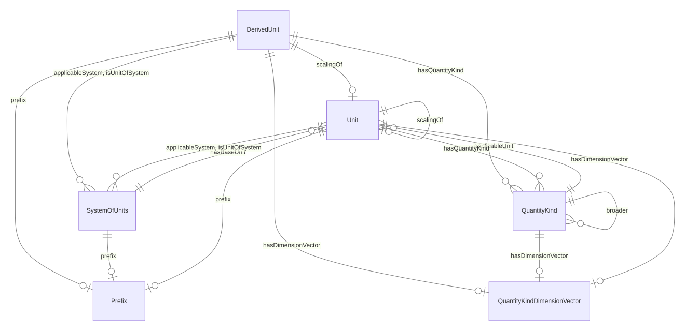

#### Attributes

| Name | Cardinality: | Type | Description |
| --- | --- | --- | --- |
| **[id](#id)** | <sub>1..1</sub> | uri | A unique identifier |
| **[name](#name)** | <sub>0..1</sub> | string | Human-readable label for the entity |
| **[description](#description)** | <sub>0..1</sub> | string | A description of the entity |
| **[abbreviation](#abbreviation)** | <sub>0..1</sub> | string | Short alphanumeric abbreviation for a unit |
| **[applicableSystem](#applicablesystem)** | <sub>0..\*</sub> | [SystemOfUnits](#systemofunits) | Systems where this unit is applicable |
| **[conversionMultiplier](#conversionmultiplier)** | <sub>0..1</sub> | double | Multiplier to convert to base unit |
| **[conversionOffset](#conversionoffset)** | <sub>0..1</sub> | double | Offset to convert to base unit |
| **[deprecated](#deprecated)** | <sub>0..1</sub> | boolean | Whether this entity is deprecated |
| **[hasDimensionVector](#hasdimensionvector)** | <sub>0..1</sub> | [QuantityKindDimensionVector](#quantitykinddimensionvector) | Dimension vector for a unit or quantity kind |
| **[hasQuantityKind](#hasquantitykind)** | <sub>0..\*</sub> | [QuantityKind](#quantitykind) | Associates a quantity with its kind (e.g., Height, Weight) |
| **[isUnitOfSystem](#isunitofsystem)** | <sub>0..\*</sub> | [SystemOfUnits](#systemofunits) | System of units this unit belongs to |
| **[latexSymbol](#latexsymbol)** | <sub>0..1</sub> | string | LaTeX representation of symbol |
| **[plainTextDescription](#plaintextdescription)** | <sub>0..1</sub> | string | Plain text description |
| **[prefix](#prefix)** | <sub>0..1</sub> | [Prefix](#prefix) | Prefix for a unit (e.g., Kilo, Milli) |
| **[scalingOf](#scalingof)** | <sub>0..1</sub> | [Unit](#unit) | Base unit this unit is a scaling of |
| **[symbol](#symbol)** | <sub>0..1</sub> | string | Symbol for a unit (e.g., "m" for meter) |
| **[ucumCode](#ucumcode)** | <sub>0..1</sub> | string | UCUM code for the unit |
| **[dbpediaMatch](#dbpediamatch)** | <sub>0..1</sub> | uri | DBpedia URI for this entity |
| **[informativeReference](#informativereference)** | <sub>0..\*</sub> | uri | Informative reference URL |
| **[isoNormativeReference](#isonormativereference)** | <sub>0..\*</sub> | uri | ISO normative reference URI |
| **[normativeReference](#normativereference)** | <sub>0..\*</sub> | uri | Normative reference URI |
| **[wikidataMatch](#wikidatamatch)** | <sub>0..1</sub> | uri | Wikidata URI for this entity |

#### Parents

 * [Unit](#unit) - Unit of measurement


### EggGroup

Egg group is a category that determines which Pokémon are able to interbreed. The concept was introduced in Generation II, along with breeding. Similar to types, a Pokémon may belong to either one or two egg groups.


#### YAML Definition

<details>
<summary>Click to expand</summary>

```yaml
EggGroup:
  is_a: NamedIndividual
  description: "Egg group is a category that determines which Pok\xE9mon are able\
    \ to interbreed. The concept was introduced in Generation II, along with breeding.\
    \ Similar to types, a Pok\xE9mon may belong to either one or two egg groups."
  slots:
  - id
  - description
  - NamedIndividual_name

```
</details>

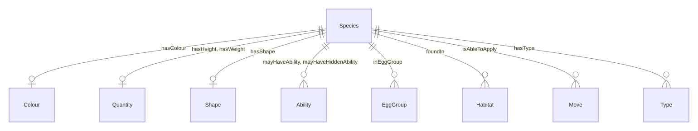

#### Attributes

| Name | Cardinality: | Type | Description |
| --- | --- | --- | --- |
| **[id](#id)** | <sub>1..1</sub> | uri | A unique identifier |
| **[name](#name)** | <sub>1..1</sub> | string | Human-readable label for the entity |
| **[description](#description)** | <sub>0..1</sub> | string | A description of the entity |

#### Parents

 * [NamedIndividual](#namedindividual) - A Thing that requires a name

#### Referenced by:

 *  **[Species](#species)** : inEggGroup  <sub>0..\*</sub> 


### Flavor

Flavor is a special set of attributes that certain foods in the Pokémon world have. Most of the foods can have more than one flavor, and the flavor determines which Pokémon can eat them.


#### YAML Definition

<details>
<summary>Click to expand</summary>

```yaml
Flavor:
  is_a: NamedIndividual
  description: "Flavor is a special set of attributes that certain foods in the Pok\xE9\
    mon world have. Most of the foods can have more than one flavor, and the flavor\
    \ determines which Pok\xE9mon can eat them."
  slots:
  - id
  - description
  - NamedIndividual_name

```
</details>

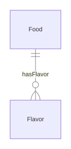

#### Attributes

| Name | Cardinality: | Type | Description |
| --- | --- | --- | --- |
| **[id](#id)** | <sub>1..1</sub> | uri | A unique identifier |
| **[name](#name)** | <sub>1..1</sub> | string | Human-readable label for the entity |
| **[description](#description)** | <sub>0..1</sub> | string | A description of the entity |

#### Parents

 * [NamedIndividual](#namedindividual) - A Thing that requires a name

#### Referenced by:

 *  **[Food](#food)** : hasFlavor  <sub>0..\*</sub> 


### Food

Food items are consumable items in the Pokémon world that can have flavors, firmness, and smoothness attributes.


#### YAML Definition

<details>
<summary>Click to expand</summary>

```yaml
Food:
  is_a: Item
  description: "Food items are consumable items in the Pok\xE9mon world that can have\
    \ flavors, firmness, and smoothness attributes."
  slots:
  - id
  - name
  - description
  - hasFlavor
  - firmness
  - smoothness

```
</details>


#### Attributes

| Name | Cardinality: | Type | Description |
| --- | --- | --- | --- |
| **[id](#id)** | <sub>1..1</sub> | uri | A unique identifier |
| **[name](#name)** | <sub>0..1</sub> | string | Human-readable label for the entity |
| **[description](#description)** | <sub>0..1</sub> | string | A description of the entity |
| **[firmness](#firmness)** | <sub>0..1</sub> | integer | How firm a berry or food item feels, affecting its use in Pokéblock or Poffin making. |
| **[hasFlavor](#hasflavor)** | <sub>0..\*</sub> | [Flavor](#flavor) | A Pokémon has a flavor |
| **[smoothness](#smoothness)** | <sub>0..1</sub> | integer | How smooth a berry or food item is, affecting its use in Pokéblock or Poffin making. |

#### Parents

 * [Item](#item) - An item is an object in the Pokémon games which the player can pick up, keep in their Bag, and use in some manner. They have various uses, including healing, powering up, helping one to catch Pokémon, or to access a new area.

#### Children

 * [Berry](#berry) - Berries are small, juicy, fleshy fruit. As in the real world, a large variety exists in the Pokémon world, with a large range of flavors, names, and effects. First found in the Generation II games, many Berries have since became critical help items in battle, where their various effects include HP and status condition restoration, stat enhancement, and even damage negation.


### Game

A game is a type of media that can be played by people.


#### YAML Definition

<details>
<summary>Click to expand</summary>

```yaml
Game:
  is_a: Thing
  description: A game is a type of media that can be played by people.
  slots:
  - id
  - name
  - description

```
</details>


#### Local class diagram


#### Attributes

| Name | Cardinality: | Type | Description |
| --- | --- | --- | --- |
| **[id](#id)** | <sub>1..1</sub> | uri | A unique identifier |
| **[name](#name)** | <sub>0..1</sub> | string | Human-readable label for the entity |
| **[description](#description)** | <sub>0..1</sub> | string | A description of the entity |

#### Parents

 * [Thing](#thing) - An rdfs:Resource that defines name and description


### Generation

Generations refers to the Pokémon game series. It is a group of games that were released at or around the same time. It also means that games in the same generation are compatible with the others, containing the same Pokémon and the number of moves there are to be learned.


#### YAML Definition

<details>
<summary>Click to expand</summary>

```yaml
Generation:
  is_a: Thing
  description: "Generations refers to the Pok\xE9mon game series. It is a group of\
    \ games that were released at or around the same time. It also means that games\
    \ in the same generation are compatible with the others, containing the same Pok\xE9\
    mon and the number of moves there are to be learned."
  slots:
  - id
  - name
  - description
  - featuresSpecies

```
</details>

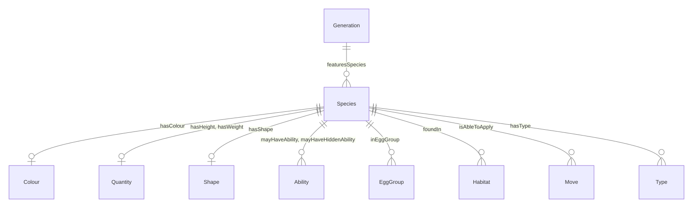

#### Attributes

| Name | Cardinality: | Type | Description |
| --- | --- | --- | --- |
| **[id](#id)** | <sub>1..1</sub> | uri | A unique identifier |
| **[name](#name)** | <sub>0..1</sub> | string | Human-readable label for the entity |
| **[description](#description)** | <sub>0..1</sub> | string | A description of the entity |
| **[featuresSpecies](#featuresspecies)** | <sub>0..\*</sub> | [Species](#species) | ['A Pokédex entry features a species'] |

#### Parents

 * [Thing](#thing) - An rdfs:Resource that defines name and description


### Gym

A gym is a location that can be battled at.


#### YAML Definition

<details>
<summary>Click to expand</summary>

```yaml
Gym:
  is_a: Place
  description: A gym is a location that can be battled at.
  slots:
  - id
  - name
  - description

```
</details>


#### Local class diagram


#### Attributes

| Name | Cardinality: | Type | Description |
| --- | --- | --- | --- |
| **[id](#id)** | <sub>1..1</sub> | uri | A unique identifier |
| **[name](#name)** | <sub>0..1</sub> | string | Human-readable label for the entity |
| **[description](#description)** | <sub>0..1</sub> | string | A description of the entity |

#### Parents

 * [Place](#place) - Entities that have a somewhat fixed, physical extension.


### GymLeader

A gym leader is the highest ranking member and owner of an official Pokémon gym. Gym leaders use their gym and their Pokémon to test the skills of trainers that challenge them, and if said trainers win a battle, the gym leader will gift them a badge that's unique to that specific gym.


#### YAML Definition

<details>
<summary>Click to expand</summary>

```yaml
GymLeader:
  is_a: Trainer
  description: "A gym leader is the highest ranking member and owner of an official\
    \ Pok\xE9mon gym. Gym leaders use their gym and their Pok\xE9mon to test the skills\
    \ of trainers that challenge them, and if said trainers win a battle, the gym\
    \ leader will gift them a badge that's unique to that specific gym."
  slots:
  - id
  - description
  - NamedIndividual_name
  - depiction

```
</details>


#### Local class diagram


#### Attributes

| Name | Cardinality: | Type | Description |
| --- | --- | --- | --- |
| **[id](#id)** | <sub>1..1</sub> | uri | A unique identifier |
| **[name](#name)** | <sub>1..1</sub> | string | Human-readable label for the entity |
| **[description](#description)** | <sub>0..1</sub> | string | A description of the entity |
| **[depiction](#depiction)** | <sub>0..1</sub> | string | A depiction of the person |

#### Parents

 * [Trainer](#trainer) - A trainer is a person who is able to catch Pokémon.


### HM

Hidden Machine


#### YAML Definition

<details>
<summary>Click to expand</summary>

```yaml
HM:
  is_a: Item
  description: Hidden Machine
  slots:
  - id
  - name
  - description

```
</details>


#### Local class diagram


#### Attributes

| Name | Cardinality: | Type | Description |
| --- | --- | --- | --- |
| **[id](#id)** | <sub>1..1</sub> | uri | A unique identifier |
| **[name](#name)** | <sub>0..1</sub> | string | Human-readable label for the entity |
| **[description](#description)** | <sub>0..1</sub> | string | A description of the entity |

#### Parents

 * [Item](#item) - An item is an object in the Pokémon games which the player can pick up, keep in their Bag, and use in some manner. They have various uses, including healing, powering up, helping one to catch Pokémon, or to access a new area.


### Habitat

A habitat is a type of environment that certain Pokémon belong to.


#### YAML Definition

<details>
<summary>Click to expand</summary>

```yaml
Habitat:
  is_a: NamedIndividual
  description: "A habitat is a type of environment that certain Pok\xE9mon belong\
    \ to."
  slots:
  - id
  - description
  - NamedIndividual_name

```
</details>


#### Attributes

| Name | Cardinality: | Type | Description |
| --- | --- | --- | --- |
| **[id](#id)** | <sub>1..1</sub> | uri | A unique identifier |
| **[name](#name)** | <sub>1..1</sub> | string | Human-readable label for the entity |
| **[description](#description)** | <sub>0..1</sub> | string | A description of the entity |

#### Parents

 * [NamedIndividual](#namedindividual) - A Thing that requires a name

#### Referenced by:

 *  **[Species](#species)** : foundIn  <sub>0..\*</sub> 


### HoldItem

A hold item is an item that can be held by a Pokémon.


#### YAML Definition

<details>
<summary>Click to expand</summary>

```yaml
HoldItem:
  is_a: Item
  description: "A hold item is an item that can be held by a Pok\xE9mon."
  slots:
  - id
  - name
  - description

```
</details>


#### Local class diagram


#### Attributes

| Name | Cardinality: | Type | Description |
| --- | --- | --- | --- |
| **[id](#id)** | <sub>1..1</sub> | uri | A unique identifier |
| **[name](#name)** | <sub>0..1</sub> | string | Human-readable label for the entity |
| **[description](#description)** | <sub>0..1</sub> | string | A description of the entity |

#### Parents

 * [Item](#item) - An item is an object in the Pokémon games which the player can pick up, keep in their Bag, and use in some manner. They have various uses, including healing, powering up, helping one to catch Pokémon, or to access a new area.


### Item

An item is an object in the Pokémon games which the player can pick up, keep in their Bag, and use in some manner. They have various uses, including healing, powering up, helping one to catch Pokémon, or to access a new area.


#### YAML Definition

<details>
<summary>Click to expand</summary>

```yaml
Item:
  is_a: Thing
  description: "An item is an object in the Pok\xE9mon games which the player can\
    \ pick up, keep in their Bag, and use in some manner. They have various uses,\
    \ including healing, powering up, helping one to catch Pok\xE9mon, or to access\
    \ a new area."
  slots:
  - id
  - name
  - description

```
</details>


#### Local class diagram


#### Attributes

| Name | Cardinality: | Type | Description |
| --- | --- | --- | --- |
| **[id](#id)** | <sub>1..1</sub> | uri | A unique identifier |
| **[name](#name)** | <sub>0..1</sub> | string | Human-readable label for the entity |
| **[description](#description)** | <sub>0..1</sub> | string | A description of the entity |

#### Parents

 * [Thing](#thing) - An rdfs:Resource that defines name and description

#### Children

 * [BattleItem](#battleitem) - Battle items are items that can be used during battles.
 * [Food](#food) - Food items are consumable items in the Pokémon world that can have flavors, firmness, and smoothness attributes.
 * [HM](#hm) - Hidden Machine
 * [HoldItem](#holditem) - A hold item is an item that can be held by a Pokémon.
 * [Medicine](#medicine) - Medicine items can heal various afflictions of a Pokémon.
 * [Pokeball](#pokeball) - A Poké Ball is a type of item that is critical to a Trainer's quest, used for catching and storing Pokémon.
 * [TM](#tm) - A Technical Machine is an item that can be used to teach a Pokémon a move.


### LearningByLevelingUp

A move that is learned by leveling up.


#### YAML Definition

<details>
<summary>Click to expand</summary>

```yaml
LearningByLevelingUp:
  is_a: MoveLearning
  description: A move that is learned by leveling up.

```
</details>


#### Local class diagram


This class has no attributes


#### Parents

 * [MoveLearning](#movelearning) - A move learning is a way that a Pokémon can learn a move.


### LearningThroughBreeding

A move that is learned by breeding.


#### YAML Definition

<details>
<summary>Click to expand</summary>

```yaml
LearningThroughBreeding:
  is_a: MoveLearning
  description: A move that is learned by breeding.

```
</details>


#### Local class diagram


This class has no attributes


#### Parents

 * [MoveLearning](#movelearning) - A move learning is a way that a Pokémon can learn a move.


### Medicine

Medicine items can heal various afflictions of a Pokémon.


#### YAML Definition

<details>
<summary>Click to expand</summary>

```yaml
Medicine:
  is_a: Item
  description: "Medicine items can heal various afflictions of a Pok\xE9mon."
  slots:
  - id
  - name
  - description

```
</details>


#### Local class diagram


#### Attributes

| Name | Cardinality: | Type | Description |
| --- | --- | --- | --- |
| **[id](#id)** | <sub>1..1</sub> | uri | A unique identifier |
| **[name](#name)** | <sub>0..1</sub> | string | Human-readable label for the entity |
| **[description](#description)** | <sub>0..1</sub> | string | A description of the entity |

#### Parents

 * [Item](#item) - An item is an object in the Pokémon games which the player can pick up, keep in their Bag, and use in some manner. They have various uses, including healing, powering up, helping one to catch Pokémon, or to access a new area.


### Move

A move is a special ability of a Pokémon.


#### YAML Definition

<details>
<summary>Click to expand</summary>

```yaml
Move:
  is_a: Thing
  description: "A move is a special ability of a Pok\xE9mon."
  slots:
  - id
  - name
  - description
  - effectDescription
  - hasType

```
</details>


#### Attributes

| Name | Cardinality: | Type | Description |
| --- | --- | --- | --- |
| **[id](#id)** | <sub>1..1</sub> | uri | A unique identifier |
| **[name](#name)** | <sub>0..1</sub> | string | Human-readable label for the entity |
| **[description](#description)** | <sub>0..1</sub> | string | A description of the entity |
| **[effectDescription](#effectdescription)** | <sub>0..\*</sub> | string | A description of the effect of the entity |
| **[hasType](#hastype)** | <sub>0..\*</sub> | [Type](#type) | A Pokémon has a type |

#### Parents

 * [Thing](#thing) - An rdfs:Resource that defines name and description

#### Children

 * [PhysicalMove](#physicalmove) - A physical move is a type of move that can be used during battles.
 * [SpecialMove](#specialmove) - A special move is a type of move that can be used during battles.
 * [StatusMove](#statusmove) - A status move is a type of move that can be used during battles.

#### Referenced by:

 *  **[Species](#species)** : isAbleToApply  <sub>0..\*</sub> 


### MoveLearning

A move learning is a way that a Pokémon can learn a move.


#### YAML Definition

<details>
<summary>Click to expand</summary>

```yaml
MoveLearning:
  description: "A move learning is a way that a Pok\xE9mon can learn a move."

```
</details>


#### Local class diagram


This class has no attributes


#### Children

 * [LearningByLevelingUp](#learningbylevelingup) - A move that is learned by leveling up.
 * [LearningThroughBreeding](#learningthroughbreeding) - A move that is learned by breeding.

#### Used as mixin by

 * [TM](#tm) - A Technical Machine is an item that can be used to teach a Pokémon a move.


### Person

A person is a human being


#### YAML Definition

<details>
<summary>Click to expand</summary>

```yaml
Person:
  is_a: NamedIndividual
  description: A person is a human being
  slots:
  - id
  - description
  - NamedIndividual_name
  - depiction

```
</details>


#### Local class diagram


#### Attributes

| Name | Cardinality: | Type | Description |
| --- | --- | --- | --- |
| **[id](#id)** | <sub>1..1</sub> | uri | A unique identifier |
| **[name](#name)** | <sub>1..1</sub> | string | Human-readable label for the entity |
| **[description](#description)** | <sub>0..1</sub> | string | A description of the entity |
| **[depiction](#depiction)** | <sub>0..1</sub> | string | A depiction of the person |

#### Parents

 * [NamedIndividual](#namedindividual) - A Thing that requires a name

#### Children

 * [Trainer](#trainer) - A trainer is a person who is able to catch Pokémon.


### PhysicalMove

A physical move is a type of move that can be used during battles.


#### YAML Definition

<details>
<summary>Click to expand</summary>

```yaml
PhysicalMove:
  is_a: Move
  description: A physical move is a type of move that can be used during battles.
  slots:
  - id
  - name
  - description
  - effectDescription
  - hasType

```
</details>

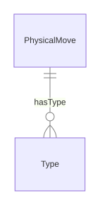

#### Attributes

| Name | Cardinality: | Type | Description |
| --- | --- | --- | --- |
| **[id](#id)** | <sub>1..1</sub> | uri | A unique identifier |
| **[name](#name)** | <sub>0..1</sub> | string | Human-readable label for the entity |
| **[description](#description)** | <sub>0..1</sub> | string | A description of the entity |
| **[effectDescription](#effectdescription)** | <sub>0..\*</sub> | string | A description of the effect of the entity |
| **[hasType](#hastype)** | <sub>0..\*</sub> | [Type](#type) | A Pokémon has a type |

#### Parents

 * [Move](#move) - A move is a special ability of a Pokémon.


### Pokeball

A Poké Ball is a type of item that is critical to a Trainer's quest, used for catching and storing Pokémon.


#### YAML Definition

<details>
<summary>Click to expand</summary>

```yaml
Pokeball:
  is_a: Item
  description: "A Pok\xE9 Ball is a type of item that is critical to a Trainer's quest,\
    \ used for catching and storing Pok\xE9mon."
  slots:
  - id
  - name
  - description

```
</details>


#### Local class diagram


#### Attributes

| Name | Cardinality: | Type | Description |
| --- | --- | --- | --- |
| **[id](#id)** | <sub>1..1</sub> | uri | A unique identifier |
| **[name](#name)** | <sub>0..1</sub> | string | Human-readable label for the entity |
| **[description](#description)** | <sub>0..1</sub> | string | A description of the entity |

#### Parents

 * [Item](#item) - An item is an object in the Pokémon games which the player can pick up, keep in their Bag, and use in some manner. They have various uses, including healing, powering up, helping one to catch Pokémon, or to access a new area.


### Pokedex

The Pokédex is an electronic device designed to catalog and provide information regarding the various species of Pokémon featured in the Pokémon video game, anime and manga series.


#### YAML Definition

<details>
<summary>Click to expand</summary>

```yaml
Pokedex:
  is_a: Thing
  description: "The Pok\xE9dex is an electronic device designed to catalog and provide\
    \ information regarding the various species of Pok\xE9mon featured in the Pok\xE9\
    mon video game, anime and manga series."
  slots:
  - id
  - name
  - description

```
</details>


#### Local class diagram


#### Attributes

| Name | Cardinality: | Type | Description |
| --- | --- | --- | --- |
| **[id](#id)** | <sub>1..1</sub> | uri | A unique identifier |
| **[name](#name)** | <sub>0..1</sub> | string | Human-readable label for the entity |
| **[description](#description)** | <sub>0..1</sub> | string | A description of the entity |

#### Parents

 * [Thing](#thing) - An rdfs:Resource that defines name and description


### PokedexEntry

A Pokédex entry is a description of a Pokémon.


#### YAML Definition

<details>
<summary>Click to expand</summary>

```yaml
PokedexEntry:
  is_a: Thing
  description: "A Pok\xE9dex entry is a description of a Pok\xE9mon."
  slots:
  - id
  - name
  - description

```
</details>


#### Local class diagram


#### Attributes

| Name | Cardinality: | Type | Description |
| --- | --- | --- | --- |
| **[id](#id)** | <sub>1..1</sub> | uri | A unique identifier |
| **[name](#name)** | <sub>0..1</sub> | string | Human-readable label for the entity |
| **[description](#description)** | <sub>0..1</sub> | string | A description of the entity |

#### Parents

 * [Thing](#thing) - An rdfs:Resource that defines name and description

#### Referenced by:


### Pokemon

A Pokémon


#### YAML Definition

<details>
<summary>Click to expand</summary>

```yaml
Pokemon:
  description: "A Pok\xE9mon"

```
</details>


This class has no attributes


### Prefix

Unit prefix (e.g., Kilo, Milli)


#### YAML Definition

<details>
<summary>Click to expand</summary>

```yaml
Prefix:
  is_a: Concept
  mixins:
  - Verifiable
  description: Unit prefix (e.g., Kilo, Milli)
  slots:
  - id
  - name
  - description
  - abbreviation
  - deprecated
  - plainTextDescription
  - symbol
  - prefixMultiplier
  - ucumCode
  - exactMatch
  - dbpediaMatch
  - wikidataMatch
  - informativeReference
  - isoNormativeReference
  - normativeReference

```
</details>

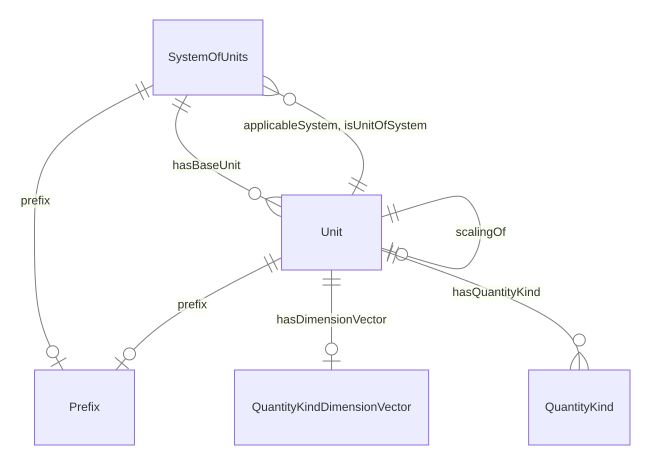

#### Attributes

| Name | Cardinality: | Type | Description |
| --- | --- | --- | --- |
| **[id](#id)** | <sub>1..1</sub> | uri | A unique identifier |
| **[name](#name)** | <sub>0..1</sub> | string | Human-readable label for the entity |
| **[description](#description)** | <sub>0..1</sub> | string | A description of the entity |
| **[abbreviation](#abbreviation)** | <sub>0..1</sub> | string | Short alphanumeric abbreviation for a unit |
| **[deprecated](#deprecated)** | <sub>0..1</sub> | boolean | Whether this entity is deprecated |
| **[plainTextDescription](#plaintextdescription)** | <sub>0..1</sub> | string | Plain text description |
| **[dbpediaMatch](#dbpediamatch)** | <sub>0..1</sub> | uri | DBpedia URI for this entity |
| **[informativeReference](#informativereference)** | <sub>0..\*</sub> | uri | Informative reference URL |
| **[isoNormativeReference](#isonormativereference)** | <sub>0..\*</sub> | uri | ISO normative reference URI |
| **[normativeReference](#normativereference)** | <sub>0..\*</sub> | uri | Normative reference URI |
| **[wikidataMatch](#wikidatamatch)** | <sub>0..1</sub> | uri | Wikidata URI for this entity |
| **[exactMatch](#exactmatch)** | <sub>0..\*</sub> | string | Equivalent quantity kind or unit |
| **[prefixMultiplier](#prefixmultiplier)** | <sub>0..1</sub> | double | Numeric multiplier for the prefix (e.g., 1000 for Kilo) |
| **[symbol](#symbol)** | <sub>0..1</sub> | string | Symbol for a unit (e.g., "m" for meter) |
| **[ucumCode](#ucumcode)** | <sub>0..1</sub> | string | UCUM code for the unit |

#### Parents

 * [Concept](#concept) - The root class for all QUDT concepts

#### Children

 * [DecimalPrefix](#decimalprefix) - Decimal prefix (powers of 10)

#### Uses

 *  mixin: [Verifiable](#verifiable) - Holds properties that provide external knowledge and specifications of a given resource

#### Referenced by:

 *  **[SystemOfUnits](#systemofunits)** : prefix  <sub>0..1</sub> 
 *  **[Unit](#unit)** : prefix  <sub>0..1</sub> 


### Quantity

A measured quantity with kind and value


#### YAML Definition

<details>
<summary>Click to expand</summary>

```yaml
Quantity:
  is_a: Concept
  mixins:
  - Quantifiable
  description: A measured quantity with kind and value
  slots:
  - id
  - name
  - description
  - abbreviation
  - deprecated
  - plainTextDescription
  - hasQuantityKind
  - quantityValue
  - hasUnit
  - standardUncertainty
  - relativeStandardUncertainty

```
</details>

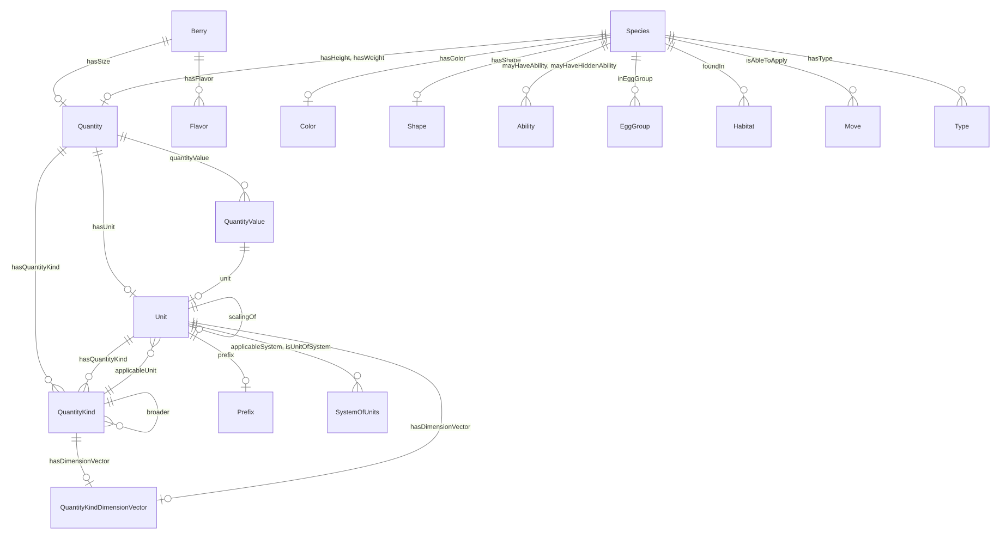

#### Attributes

| Name | Cardinality: | Type | Description |
| --- | --- | --- | --- |
| **[id](#id)** | <sub>1..1</sub> | uri | A unique identifier |
| **[name](#name)** | <sub>0..1</sub> | string | Human-readable label for the entity |
| **[description](#description)** | <sub>0..1</sub> | string | A description of the entity |
| **[abbreviation](#abbreviation)** | <sub>0..1</sub> | string | Short alphanumeric abbreviation for a unit |
| **[deprecated](#deprecated)** | <sub>0..1</sub> | boolean | Whether this entity is deprecated |
| **[plainTextDescription](#plaintextdescription)** | <sub>0..1</sub> | string | Plain text description |
| **[hasUnit](#hasunit)** | <sub>0..1</sub> | [Unit](#unit) | Unit associated with a quantifiable entity |
| **[relativeStandardUncertainty](#relativestandarduncertainty)** | <sub>0..1</sub> | double | Relative standard uncertainty of the measurement |
| **[standardUncertainty](#standarduncertainty)** | <sub>0..1</sub> | decimal | Standard uncertainty of the measurement |
| **[hasQuantityKind](#hasquantitykind)** | <sub>0..\*</sub> | [QuantityKind](#quantitykind) | Associates a quantity with its kind (e.g., Height, Weight) |
| **[quantityValue](#quantityvalue)** | <sub>0..\*</sub> | [QuantityValue](#quantityvalue) | The value component of a quantity |

#### Parents

 * [Concept](#concept) - The root class for all QUDT concepts

#### Uses

 *  mixin: [Quantifiable](#quantifiable) - Ascribes to some thing the capability of being measured, observed, or counted

#### Referenced by:

 *  **[Species](#species)** : hasHeight  <sub>0..1</sub> 
 *  **[Berry](#berry)** : hasSize  <sub>0..1</sub> 
 *  **[Species](#species)** : hasWeight  <sub>0..1</sub> 


### QuantityKind

Kind of quantity (e.g., Length, Mass, Height, Weight)


#### YAML Definition

<details>
<summary>Click to expand</summary>

```yaml
QuantityKind:
  is_a: AbstractQuantityKind
  mixins:
  - Verifiable
  description: Kind of quantity (e.g., Length, Mass, Height, Weight)
  slots:
  - id
  - name
  - description
  - abbreviation
  - deprecated
  - plainTextDescription
  - symbol
  - broader
  - latexSymbol
  - hasDimensionVector
  - applicableUnit
  - exactMatch
  - dbpediaMatch
  - wikidataMatch
  - informativeReference
  - isoNormativeReference
  - normativeReference

```
</details>

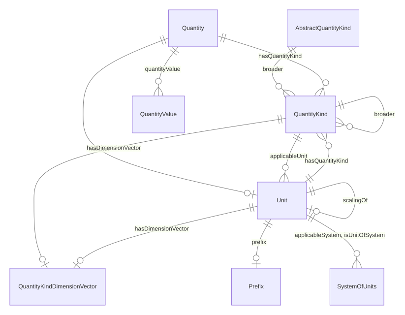

#### Attributes

| Name | Cardinality: | Type | Description |
| --- | --- | --- | --- |
| **[id](#id)** | <sub>1..1</sub> | uri | A unique identifier |
| **[name](#name)** | <sub>0..1</sub> | string | Human-readable label for the entity |
| **[description](#description)** | <sub>0..1</sub> | string | A description of the entity |
| **[abbreviation](#abbreviation)** | <sub>0..1</sub> | string | Short alphanumeric abbreviation for a unit |
| **[broader](#broader)** | <sub>0..\*</sub> | [QuantityKind](#quantitykind) | Broader/parent quantity kind |
| **[deprecated](#deprecated)** | <sub>0..1</sub> | boolean | Whether this entity is deprecated |
| **[plainTextDescription](#plaintextdescription)** | <sub>0..1</sub> | string | Plain text description |
| **[symbol](#symbol)** | <sub>0..1</sub> | string | Symbol for a unit (e.g., "m" for meter) |
| **[dbpediaMatch](#dbpediamatch)** | <sub>0..1</sub> | uri | DBpedia URI for this entity |
| **[informativeReference](#informativereference)** | <sub>0..\*</sub> | uri | Informative reference URL |
| **[isoNormativeReference](#isonormativereference)** | <sub>0..\*</sub> | uri | ISO normative reference URI |
| **[normativeReference](#normativereference)** | <sub>0..\*</sub> | uri | Normative reference URI |
| **[wikidataMatch](#wikidatamatch)** | <sub>0..1</sub> | uri | Wikidata URI for this entity |
| **[applicableUnit](#applicableunit)** | <sub>0..\*</sub> | [Unit](#unit) | Units applicable to a quantity kind |
| **[exactMatch](#exactmatch)** | <sub>0..\*</sub> | string | Equivalent quantity kind or unit |
| **[hasDimensionVector](#hasdimensionvector)** | <sub>0..1</sub> | [QuantityKindDimensionVector](#quantitykinddimensionvector) | Dimension vector for a unit or quantity kind |
| **[latexSymbol](#latexsymbol)** | <sub>0..1</sub> | string | LaTeX representation of symbol |

#### Parents

 * [AbstractQuantityKind](#abstractquantitykind) - Abstract base for quantity kinds, constraining symbol and broader

#### Uses

 *  mixin: [Verifiable](#verifiable) - Holds properties that provide external knowledge and specifications of a given resource

#### Referenced by:

 *  **[AbstractQuantityKind](#abstractquantitykind)** : broader  <sub>0..\*</sub> 
 *  **[Quantity](#quantity)** : hasQuantityKind  <sub>0..\*</sub> 
 *  **[Unit](#unit)** : hasQuantityKind  <sub>0..\*</sub> 


### QuantityKindDimensionVector

Dimension vector expressing quantity in base dimensions


#### YAML Definition

<details>
<summary>Click to expand</summary>

```yaml
QuantityKindDimensionVector:
  is_a: Concept
  description: Dimension vector expressing quantity in base dimensions
  slots:
  - id
  - name
  - description
  - abbreviation
  - deprecated
  - plainTextDescription
  - latexSymbol
  - dimensionExponentForLength
  - dimensionExponentForMass
  - dimensionExponentForTime
  - dimensionExponentForElectricCurrent
  - dimensionExponentForThermodynamicTemperature
  - dimensionExponentForAmountOfSubstance
  - dimensionExponentForLuminousIntensity
  - dimensionlessExponent

```
</details>

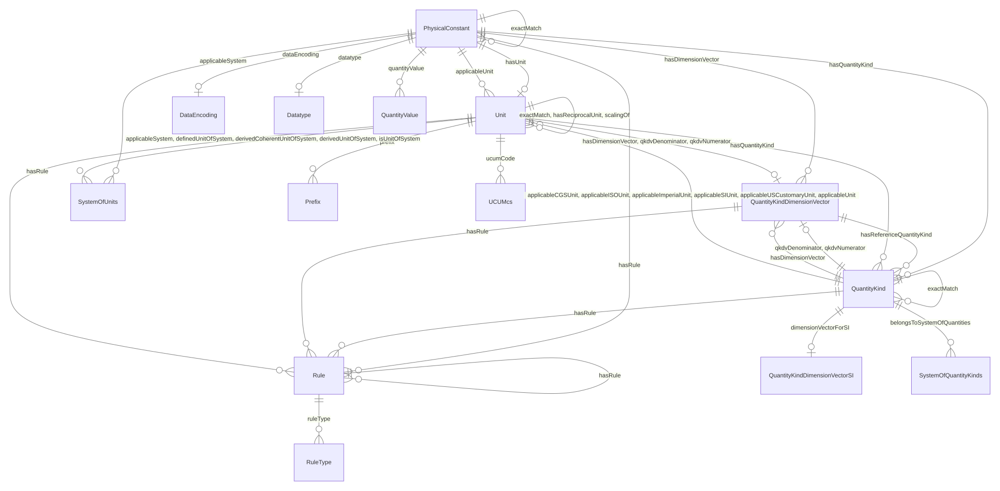

#### Attributes

| Name | Cardinality: | Type | Description |
| --- | --- | --- | --- |
| **[id](#id)** | <sub>1..1</sub> | uri | A unique identifier |
| **[name](#name)** | <sub>0..1</sub> | string | Human-readable label for the entity |
| **[description](#description)** | <sub>0..1</sub> | string | A description of the entity |
| **[abbreviation](#abbreviation)** | <sub>0..1</sub> | string | Short alphanumeric abbreviation for a unit |
| **[deprecated](#deprecated)** | <sub>0..1</sub> | boolean | Whether this entity is deprecated |
| **[plainTextDescription](#plaintextdescription)** | <sub>0..1</sub> | string | Plain text description |
| **[dimensionExponentForAmountOfSubstance](#dimensionexponentforamountofsubstance)** | <sub>0..1</sub> | integer | Exponent for amount of substance dimension (N) |
| **[dimensionExponentForElectricCurrent](#dimensionexponentforelectriccurrent)** | <sub>0..1</sub> | integer | Exponent for electric current dimension (I) |
| **[dimensionExponentForLength](#dimensionexponentforlength)** | <sub>0..1</sub> | integer | Exponent for length dimension (L) |
| **[dimensionExponentForLuminousIntensity](#dimensionexponentforluminousintensity)** | <sub>0..1</sub> | integer | Exponent for luminous intensity dimension (J) |
| **[dimensionExponentForMass](#dimensionexponentformass)** | <sub>0..1</sub> | integer | Exponent for mass dimension (M) |
| **[dimensionExponentForThermodynamicTemperature](#dimensionexponentforthermodynamictemperature)** | <sub>0..1</sub> | integer | Exponent for temperature dimension (Θ) |
| **[dimensionExponentForTime](#dimensionexponentfortime)** | <sub>0..1</sub> | integer | Exponent for time dimension (T) |
| **[dimensionlessExponent](#dimensionlessexponent)** | <sub>0..1</sub> | integer | Dimensionless exponent |
| **[latexSymbol](#latexsymbol)** | <sub>0..1</sub> | string | LaTeX representation of symbol |

#### Parents

 * [Concept](#concept) - The root class for all QUDT concepts

#### Children

 * [QuantityKindDimensionVectorCGS](#quantitykinddimensionvectorcgs) - CGS dimension vector
 * [QuantityKindDimensionVectorISO](#quantitykinddimensionvectoriso) - ISO dimension vector
 * [QuantityKindDimensionVectorImperial](#quantitykinddimensionvectorimperial) - Imperial dimension vector
 * [QuantityKindDimensionVectorSI](#quantitykinddimensionvectorsi) - SI dimension vector

#### Referenced by:

 *  **[QuantityKind](#quantitykind)** : hasDimensionVector  <sub>0..1</sub> 
 *  **[Unit](#unit)** : hasDimensionVector  <sub>0..1</sub> 


### QuantityKindDimensionVectorCGS

CGS dimension vector


#### YAML Definition

<details>
<summary>Click to expand</summary>

```yaml
QuantityKindDimensionVector_CGS:
  is_a: QuantityKindDimensionVector
  description: CGS dimension vector
  slots:
  - id
  - name
  - description
  - abbreviation
  - deprecated
  - plainTextDescription
  - latexSymbol
  - dimensionExponentForLength
  - dimensionExponentForMass
  - dimensionExponentForTime
  - dimensionExponentForElectricCurrent
  - dimensionExponentForThermodynamicTemperature
  - dimensionExponentForAmountOfSubstance
  - dimensionExponentForLuminousIntensity
  - dimensionlessExponent

```
</details>


#### Local class diagram


#### Attributes

| Name | Cardinality: | Type | Description |
| --- | --- | --- | --- |
| **[id](#id)** | <sub>1..1</sub> | uri | A unique identifier |
| **[name](#name)** | <sub>0..1</sub> | string | Human-readable label for the entity |
| **[description](#description)** | <sub>0..1</sub> | string | A description of the entity |
| **[abbreviation](#abbreviation)** | <sub>0..1</sub> | string | Short alphanumeric abbreviation for a unit |
| **[deprecated](#deprecated)** | <sub>0..1</sub> | boolean | Whether this entity is deprecated |
| **[dimensionExponentForAmountOfSubstance](#dimensionexponentforamountofsubstance)** | <sub>0..1</sub> | integer | Exponent for amount of substance dimension (N) |
| **[dimensionExponentForElectricCurrent](#dimensionexponentforelectriccurrent)** | <sub>0..1</sub> | integer | Exponent for electric current dimension (I) |
| **[dimensionExponentForLength](#dimensionexponentforlength)** | <sub>0..1</sub> | integer | Exponent for length dimension (L) |
| **[dimensionExponentForLuminousIntensity](#dimensionexponentforluminousintensity)** | <sub>0..1</sub> | integer | Exponent for luminous intensity dimension (J) |
| **[dimensionExponentForMass](#dimensionexponentformass)** | <sub>0..1</sub> | integer | Exponent for mass dimension (M) |
| **[dimensionExponentForThermodynamicTemperature](#dimensionexponentforthermodynamictemperature)** | <sub>0..1</sub> | integer | Exponent for temperature dimension (Θ) |
| **[dimensionExponentForTime](#dimensionexponentfortime)** | <sub>0..1</sub> | integer | Exponent for time dimension (T) |
| **[dimensionlessExponent](#dimensionlessexponent)** | <sub>0..1</sub> | integer | Dimensionless exponent |
| **[latexSymbol](#latexsymbol)** | <sub>0..1</sub> | string | LaTeX representation of symbol |
| **[plainTextDescription](#plaintextdescription)** | <sub>0..1</sub> | string | Plain text description |

#### Parents

 * [QuantityKindDimensionVector](#quantitykinddimensionvector) - Dimension vector expressing quantity in base dimensions


### QuantityKindDimensionVectorISO

ISO dimension vector


#### YAML Definition

<details>
<summary>Click to expand</summary>

```yaml
QuantityKindDimensionVector_ISO:
  is_a: QuantityKindDimensionVector
  description: ISO dimension vector
  slots:
  - id
  - name
  - description
  - abbreviation
  - deprecated
  - plainTextDescription
  - latexSymbol
  - dimensionExponentForLength
  - dimensionExponentForMass
  - dimensionExponentForTime
  - dimensionExponentForElectricCurrent
  - dimensionExponentForThermodynamicTemperature
  - dimensionExponentForAmountOfSubstance
  - dimensionExponentForLuminousIntensity
  - dimensionlessExponent

```
</details>


#### Local class diagram


#### Attributes

| Name | Cardinality: | Type | Description |
| --- | --- | --- | --- |
| **[id](#id)** | <sub>1..1</sub> | uri | A unique identifier |
| **[name](#name)** | <sub>0..1</sub> | string | Human-readable label for the entity |
| **[description](#description)** | <sub>0..1</sub> | string | A description of the entity |
| **[abbreviation](#abbreviation)** | <sub>0..1</sub> | string | Short alphanumeric abbreviation for a unit |
| **[deprecated](#deprecated)** | <sub>0..1</sub> | boolean | Whether this entity is deprecated |
| **[dimensionExponentForAmountOfSubstance](#dimensionexponentforamountofsubstance)** | <sub>0..1</sub> | integer | Exponent for amount of substance dimension (N) |
| **[dimensionExponentForElectricCurrent](#dimensionexponentforelectriccurrent)** | <sub>0..1</sub> | integer | Exponent for electric current dimension (I) |
| **[dimensionExponentForLength](#dimensionexponentforlength)** | <sub>0..1</sub> | integer | Exponent for length dimension (L) |
| **[dimensionExponentForLuminousIntensity](#dimensionexponentforluminousintensity)** | <sub>0..1</sub> | integer | Exponent for luminous intensity dimension (J) |
| **[dimensionExponentForMass](#dimensionexponentformass)** | <sub>0..1</sub> | integer | Exponent for mass dimension (M) |
| **[dimensionExponentForThermodynamicTemperature](#dimensionexponentforthermodynamictemperature)** | <sub>0..1</sub> | integer | Exponent for temperature dimension (Θ) |
| **[dimensionExponentForTime](#dimensionexponentfortime)** | <sub>0..1</sub> | integer | Exponent for time dimension (T) |
| **[dimensionlessExponent](#dimensionlessexponent)** | <sub>0..1</sub> | integer | Dimensionless exponent |
| **[latexSymbol](#latexsymbol)** | <sub>0..1</sub> | string | LaTeX representation of symbol |
| **[plainTextDescription](#plaintextdescription)** | <sub>0..1</sub> | string | Plain text description |

#### Parents

 * [QuantityKindDimensionVector](#quantitykinddimensionvector) - Dimension vector expressing quantity in base dimensions


### QuantityKindDimensionVectorImperial

Imperial dimension vector


#### YAML Definition

<details>
<summary>Click to expand</summary>

```yaml
QuantityKindDimensionVector_Imperial:
  is_a: QuantityKindDimensionVector
  description: Imperial dimension vector
  slots:
  - id
  - name
  - description
  - abbreviation
  - deprecated
  - plainTextDescription
  - latexSymbol
  - dimensionExponentForLength
  - dimensionExponentForMass
  - dimensionExponentForTime
  - dimensionExponentForElectricCurrent
  - dimensionExponentForThermodynamicTemperature
  - dimensionExponentForAmountOfSubstance
  - dimensionExponentForLuminousIntensity
  - dimensionlessExponent

```
</details>


#### Local class diagram


#### Attributes

| Name | Cardinality: | Type | Description |
| --- | --- | --- | --- |
| **[id](#id)** | <sub>1..1</sub> | uri | A unique identifier |
| **[name](#name)** | <sub>0..1</sub> | string | Human-readable label for the entity |
| **[description](#description)** | <sub>0..1</sub> | string | A description of the entity |
| **[abbreviation](#abbreviation)** | <sub>0..1</sub> | string | Short alphanumeric abbreviation for a unit |
| **[deprecated](#deprecated)** | <sub>0..1</sub> | boolean | Whether this entity is deprecated |
| **[dimensionExponentForAmountOfSubstance](#dimensionexponentforamountofsubstance)** | <sub>0..1</sub> | integer | Exponent for amount of substance dimension (N) |
| **[dimensionExponentForElectricCurrent](#dimensionexponentforelectriccurrent)** | <sub>0..1</sub> | integer | Exponent for electric current dimension (I) |
| **[dimensionExponentForLength](#dimensionexponentforlength)** | <sub>0..1</sub> | integer | Exponent for length dimension (L) |
| **[dimensionExponentForLuminousIntensity](#dimensionexponentforluminousintensity)** | <sub>0..1</sub> | integer | Exponent for luminous intensity dimension (J) |
| **[dimensionExponentForMass](#dimensionexponentformass)** | <sub>0..1</sub> | integer | Exponent for mass dimension (M) |
| **[dimensionExponentForThermodynamicTemperature](#dimensionexponentforthermodynamictemperature)** | <sub>0..1</sub> | integer | Exponent for temperature dimension (Θ) |
| **[dimensionExponentForTime](#dimensionexponentfortime)** | <sub>0..1</sub> | integer | Exponent for time dimension (T) |
| **[dimensionlessExponent](#dimensionlessexponent)** | <sub>0..1</sub> | integer | Dimensionless exponent |
| **[latexSymbol](#latexsymbol)** | <sub>0..1</sub> | string | LaTeX representation of symbol |
| **[plainTextDescription](#plaintextdescription)** | <sub>0..1</sub> | string | Plain text description |

#### Parents

 * [QuantityKindDimensionVector](#quantitykinddimensionvector) - Dimension vector expressing quantity in base dimensions


### QuantityKindDimensionVectorSI

SI dimension vector


#### YAML Definition

<details>
<summary>Click to expand</summary>

```yaml
QuantityKindDimensionVector_SI:
  is_a: QuantityKindDimensionVector
  description: SI dimension vector
  slots:
  - id
  - name
  - description
  - abbreviation
  - deprecated
  - plainTextDescription
  - latexSymbol
  - dimensionExponentForLength
  - dimensionExponentForMass
  - dimensionExponentForTime
  - dimensionExponentForElectricCurrent
  - dimensionExponentForThermodynamicTemperature
  - dimensionExponentForAmountOfSubstance
  - dimensionExponentForLuminousIntensity
  - dimensionlessExponent

```
</details>


#### Local class diagram


#### Attributes

| Name | Cardinality: | Type | Description |
| --- | --- | --- | --- |
| **[id](#id)** | <sub>1..1</sub> | uri | A unique identifier |
| **[name](#name)** | <sub>0..1</sub> | string | Human-readable label for the entity |
| **[description](#description)** | <sub>0..1</sub> | string | A description of the entity |
| **[abbreviation](#abbreviation)** | <sub>0..1</sub> | string | Short alphanumeric abbreviation for a unit |
| **[deprecated](#deprecated)** | <sub>0..1</sub> | boolean | Whether this entity is deprecated |
| **[dimensionExponentForAmountOfSubstance](#dimensionexponentforamountofsubstance)** | <sub>0..1</sub> | integer | Exponent for amount of substance dimension (N) |
| **[dimensionExponentForElectricCurrent](#dimensionexponentforelectriccurrent)** | <sub>0..1</sub> | integer | Exponent for electric current dimension (I) |
| **[dimensionExponentForLength](#dimensionexponentforlength)** | <sub>0..1</sub> | integer | Exponent for length dimension (L) |
| **[dimensionExponentForLuminousIntensity](#dimensionexponentforluminousintensity)** | <sub>0..1</sub> | integer | Exponent for luminous intensity dimension (J) |
| **[dimensionExponentForMass](#dimensionexponentformass)** | <sub>0..1</sub> | integer | Exponent for mass dimension (M) |
| **[dimensionExponentForThermodynamicTemperature](#dimensionexponentforthermodynamictemperature)** | <sub>0..1</sub> | integer | Exponent for temperature dimension (Θ) |
| **[dimensionExponentForTime](#dimensionexponentfortime)** | <sub>0..1</sub> | integer | Exponent for time dimension (T) |
| **[dimensionlessExponent](#dimensionlessexponent)** | <sub>0..1</sub> | integer | Dimensionless exponent |
| **[latexSymbol](#latexsymbol)** | <sub>0..1</sub> | string | LaTeX representation of symbol |
| **[plainTextDescription](#plaintextdescription)** | <sub>0..1</sub> | string | Plain text description |

#### Parents

 * [QuantityKindDimensionVector](#quantitykinddimensionvector) - Dimension vector expressing quantity in base dimensions


### QuantityValue

Numeric value with unit


#### YAML Definition

<details>
<summary>Click to expand</summary>

```yaml
QuantityValue:
  is_a: Concept
  description: Numeric value with unit
  slots:
  - id
  - name
  - description
  - abbreviation
  - deprecated
  - plainTextDescription
  - numericValue
  - unit

```
</details>

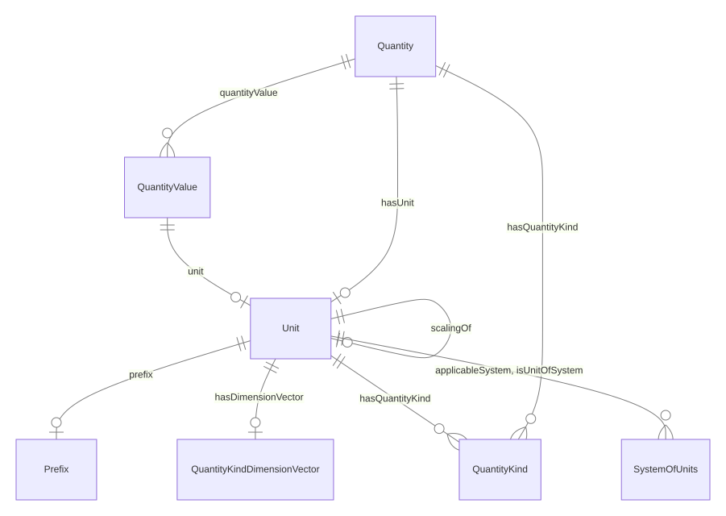

#### Attributes

| Name | Cardinality: | Type | Description |
| --- | --- | --- | --- |
| **[id](#id)** | <sub>1..1</sub> | uri | A unique identifier |
| **[name](#name)** | <sub>0..1</sub> | string | Human-readable label for the entity |
| **[description](#description)** | <sub>0..1</sub> | string | A description of the entity |
| **[abbreviation](#abbreviation)** | <sub>0..1</sub> | string | Short alphanumeric abbreviation for a unit |
| **[deprecated](#deprecated)** | <sub>0..1</sub> | boolean | Whether this entity is deprecated |
| **[plainTextDescription](#plaintextdescription)** | <sub>0..1</sub> | string | Plain text description |
| **[numericValue](#numericvalue)** | <sub>0..1</sub> | double | Numeric value of a quantity |
| **[unit](#unit)** | <sub>0..1</sub> | [Unit](#unit) | Unit of measurement |

#### Parents

 * [Concept](#concept) - The root class for all QUDT concepts

#### Referenced by:

 *  **[Quantity](#quantity)** : quantityValue  <sub>0..\*</sub> 


### Region

Regions are areas in the Pokémon universe that are smaller parts of a nation.


#### YAML Definition

<details>
<summary>Click to expand</summary>

```yaml
Region:
  is_a: Place
  description: "Regions are areas in the Pok\xE9mon universe that are smaller parts\
    \ of a nation."
  slots:
  - id
  - name
  - description

```
</details>


#### Local class diagram


#### Attributes

| Name | Cardinality: | Type | Description |
| --- | --- | --- | --- |
| **[id](#id)** | <sub>1..1</sub> | uri | A unique identifier |
| **[name](#name)** | <sub>0..1</sub> | string | Human-readable label for the entity |
| **[description](#description)** | <sub>0..1</sub> | string | A description of the entity |

#### Parents

 * [Place](#place) - Entities that have a somewhat fixed, physical extension.


### Shape

Shapes are categories that certain Pokémon belong to, which determine which Pokémon they can breed with.


#### YAML Definition

<details>
<summary>Click to expand</summary>

```yaml
Shape:
  is_a: NamedIndividual
  description: "Shapes are categories that certain Pok\xE9mon belong to, which determine\
    \ which Pok\xE9mon they can breed with."
  slots:
  - id
  - description
  - NamedIndividual_name

```
</details>


#### Attributes

| Name | Cardinality: | Type | Description |
| --- | --- | --- | --- |
| **[id](#id)** | <sub>1..1</sub> | uri | A unique identifier |
| **[name](#name)** | <sub>1..1</sub> | string | Human-readable label for the entity |
| **[description](#description)** | <sub>0..1</sub> | string | A description of the entity |

#### Parents

 * [NamedIndividual](#namedindividual) - A Thing that requires a name

#### Referenced by:

 *  **[Species](#species)** : hasShape  <sub>0..1</sub> 


### SpecialMove

A special move is a type of move that can be used during battles.


#### YAML Definition

<details>
<summary>Click to expand</summary>

```yaml
SpecialMove:
  is_a: Move
  description: A special move is a type of move that can be used during battles.
  slots:
  - id
  - name
  - description
  - effectDescription
  - hasType

```
</details>

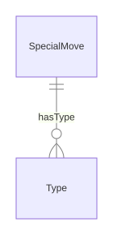

#### Attributes

| Name | Cardinality: | Type | Description |
| --- | --- | --- | --- |
| **[id](#id)** | <sub>1..1</sub> | uri | A unique identifier |
| **[name](#name)** | <sub>0..1</sub> | string | Human-readable label for the entity |
| **[description](#description)** | <sub>0..1</sub> | string | A description of the entity |
| **[effectDescription](#effectdescription)** | <sub>0..\*</sub> | string | A description of the effect of the entity |
| **[hasType](#hastype)** | <sub>0..\*</sub> | [Type](#type) | A Pokémon has a type |

#### Parents

 * [Move](#move) - A move is a special ability of a Pokémon.


### Species

A species is a category of Pokémon that share common features.


#### YAML Definition

<details>
<summary>Click to expand</summary>

```yaml
Species:
  is_a: NamedIndividual
  description: "A species is a category of Pok\xE9mon that share common features."
  slots:
  - id
  - description
  - NamedIndividual_name
  - hasColor
  - mayHaveHiddenAbility
  - mayHaveAbility
  - isAbleToApply
  - hasHeight
  - hasWeight
  - depiction
  - inEggGroup
  - hasType
  - hasShape
  - hasGenus
  - hasCatchRate
  - foundIn

```
</details>


#### Attributes

| Name | Cardinality: | Type | Description |
| --- | --- | --- | --- |
| **[id](#id)** | <sub>1..1</sub> | uri | A unique identifier |
| **[name](#name)** | <sub>1..1</sub> | string | Human-readable label for the entity |
| **[description](#description)** | <sub>0..1</sub> | string | A description of the entity |
| **[depiction](#depiction)** | <sub>0..1</sub> | string | A depiction of the person |
| **[foundIn](#foundin)** | <sub>0..\*</sub> | [Habitat](#habitat) | A place is found in a location |
| **[hasCatchRate](#hascatchrate)** | <sub>0..1</sub> | integer | Determines how easy a Pokémon species is to catch, with higher values meaning easier capture. |
| **[hasColor](#hascolor)** | <sub>0..1</sub> | [Color](#color) | A Pokémon has a color |
| **[hasGenus](#hasgenus)** | <sub>0..1</sub> | string | The species category label shown in the Pokédex, such as "Seed Pokémon" for Bulbasaur. |
| **[hasHeight](#hasheight)** | <sub>0..1</sub> | [Quantity](#quantity) | How tall a Pokémon species is, expressed as a quantity with unit. |
| **[hasShape](#hasshape)** | <sub>0..1</sub> | [Shape](#shape) | The shape of a berry is a measure of how good it is for making a Potion. |
| **[hasType](#hastype)** | <sub>0..\*</sub> | [Type](#type) | A Pokémon has a type |
| **[hasWeight](#hasweight)** | <sub>0..1</sub> | [Quantity](#quantity) | How heavy a Pokémon species is, expressed as a quantity with unit. |
| **[inEggGroup](#inegggroup)** | <sub>0..\*</sub> | [EggGroup](#egggroup) | Which egg group a species belongs to, controlling which Pokémon can breed together. |
| **[isAbleToApply](#isabletoapply)** | <sub>0..\*</sub> | [Move](#move) | Moves that a Pokémon can use in battle or in the overworld. |
| **[mayHaveAbility](#mayhaveability)** | <sub>0..\*</sub> | [Ability](#ability) | A Pokémon may have an ability |
| **[mayHaveHiddenAbility](#mayhavehiddenability)** | <sub>0..\*</sub> | [Ability](#ability) | A special ability only obtainable through specific encounters or events, not through normal gameplay. |

#### Parents

 * [NamedIndividual](#namedindividual) - A Thing that requires a name

#### Referenced by:

 *  **[Generation](#generation)** : featuresSpecies  <sub>0..\*</sub> 


### StatusMove

A status move is a type of move that can be used during battles.


#### YAML Definition

<details>
<summary>Click to expand</summary>

```yaml
StatusMove:
  is_a: Move
  description: A status move is a type of move that can be used during battles.
  slots:
  - id
  - name
  - description
  - effectDescription
  - hasType

```
</details>

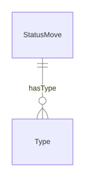

#### Attributes

| Name | Cardinality: | Type | Description |
| --- | --- | --- | --- |
| **[id](#id)** | <sub>1..1</sub> | uri | A unique identifier |
| **[name](#name)** | <sub>0..1</sub> | string | Human-readable label for the entity |
| **[description](#description)** | <sub>0..1</sub> | string | A description of the entity |
| **[effectDescription](#effectdescription)** | <sub>0..\*</sub> | string | A description of the effect of the entity |
| **[hasType](#hastype)** | <sub>0..\*</sub> | [Type](#type) | A Pokémon has a type |

#### Parents

 * [Move](#move) - A move is a special ability of a Pokémon.


### SystemOfUnits

A coherent system of units (e.g., SI, CGS)


#### YAML Definition

<details>
<summary>Click to expand</summary>

```yaml
SystemOfUnits:
  is_a: Concept
  description: A coherent system of units (e.g., SI, CGS)
  slots:
  - id
  - name
  - description
  - abbreviation
  - deprecated
  - plainTextDescription
  - hasBaseUnit
  - prefix

```
</details>


#### Attributes

| Name | Cardinality: | Type | Description |
| --- | --- | --- | --- |
| **[id](#id)** | <sub>1..1</sub> | uri | A unique identifier |
| **[name](#name)** | <sub>0..1</sub> | string | Human-readable label for the entity |
| **[description](#description)** | <sub>0..1</sub> | string | A description of the entity |
| **[abbreviation](#abbreviation)** | <sub>0..1</sub> | string | Short alphanumeric abbreviation for a unit |
| **[deprecated](#deprecated)** | <sub>0..1</sub> | boolean | Whether this entity is deprecated |
| **[plainTextDescription](#plaintextdescription)** | <sub>0..1</sub> | string | Plain text description |
| **[hasBaseUnit](#hasbaseunit)** | <sub>0..\*</sub> | [Unit](#unit) | Base units defined by this system |
| **[prefix](#prefix)** | <sub>0..1</sub> | [Prefix](#prefix) | Prefix for a unit (e.g., Kilo, Milli) |

#### Parents

 * [Concept](#concept) - The root class for all QUDT concepts

#### Referenced by:

 *  **[Unit](#unit)** : applicableSystem  <sub>0..\*</sub> 
 *  **[Unit](#unit)** : isUnitOfSystem  <sub>0..\*</sub> 


### TM

A Technical Machine is an item that can be used to teach a Pokémon a move.


#### YAML Definition

<details>
<summary>Click to expand</summary>

```yaml
TM:
  is_a: Item
  mixins:
  - MoveLearning
  description: "A Technical Machine is an item that can be used to teach a Pok\xE9\
    mon a move."
  slots:
  - id
  - name
  - description

```
</details>


#### Local class diagram


#### Attributes

| Name | Cardinality: | Type | Description |
| --- | --- | --- | --- |
| **[id](#id)** | <sub>1..1</sub> | uri | A unique identifier |
| **[name](#name)** | <sub>0..1</sub> | string | Human-readable label for the entity |
| **[description](#description)** | <sub>0..1</sub> | string | A description of the entity |

#### Parents

 * [Item](#item) - An item is an object in the Pokémon games which the player can pick up, keep in their Bag, and use in some manner. They have various uses, including healing, powering up, helping one to catch Pokémon, or to access a new area.

#### Uses

 *  mixin: [MoveLearning](#movelearning) - A move learning is a way that a Pokémon can learn a move.


### Town

A town is a type of place that can be visited.


#### YAML Definition

<details>
<summary>Click to expand</summary>

```yaml
Town:
  is_a: Place
  description: A town is a type of place that can be visited.
  slots:
  - id
  - name
  - description

```
</details>


#### Local class diagram


#### Attributes

| Name | Cardinality: | Type | Description |
| --- | --- | --- | --- |
| **[id](#id)** | <sub>1..1</sub> | uri | A unique identifier |
| **[name](#name)** | <sub>0..1</sub> | string | Human-readable label for the entity |
| **[description](#description)** | <sub>0..1</sub> | string | A description of the entity |

#### Parents

 * [Place](#place) - Entities that have a somewhat fixed, physical extension.


### Trainer

A trainer is a person who is able to catch Pokémon.


#### YAML Definition

<details>
<summary>Click to expand</summary>

```yaml
Trainer:
  is_a: Person
  description: "A trainer is a person who is able to catch Pok\xE9mon."
  slots:
  - id
  - description
  - NamedIndividual_name
  - depiction

```
</details>


#### Local class diagram


#### Attributes

| Name | Cardinality: | Type | Description |
| --- | --- | --- | --- |
| **[id](#id)** | <sub>1..1</sub> | uri | A unique identifier |
| **[name](#name)** | <sub>1..1</sub> | string | Human-readable label for the entity |
| **[description](#description)** | <sub>0..1</sub> | string | A description of the entity |
| **[depiction](#depiction)** | <sub>0..1</sub> | string | A depiction of the person |

#### Parents

 * [Person](#person) - A person is a human being

#### Children

 * [GymLeader](#gymleader) - A gym leader is the highest ranking member and owner of an official Pokémon gym. Gym leaders use their gym and their Pokémon to test the skills of trainers that challenge them, and if said trainers win a battle, the gym leader will gift them a badge that's unique to that specific gym.


### Type

All Pokémon creatures and their moves are assigned certain types. Each type has several strengths and weaknesses in both attack and defense.


#### YAML Definition

<details>
<summary>Click to expand</summary>

```yaml
Type:
  is_a: NamedIndividual
  description: "All Pok\xE9mon creatures and their moves are assigned certain types.\
    \ Each type has several strengths and weaknesses in both attack and defense."
  slots:
  - id
  - description
  - NamedIndividual_name

```
</details>


#### Attributes

| Name | Cardinality: | Type | Description |
| --- | --- | --- | --- |
| **[id](#id)** | <sub>1..1</sub> | uri | A unique identifier |
| **[name](#name)** | <sub>1..1</sub> | string | Human-readable label for the entity |
| **[description](#description)** | <sub>0..1</sub> | string | A description of the entity |

#### Parents

 * [NamedIndividual](#namedindividual) - A Thing that requires a name

#### Referenced by:

 *  **[Move](#move)** : hasType  <sub>0..\*</sub> 
 *  **[Species](#species)** : hasType  <sub>0..\*</sub> 


### Unit

Unit of measurement


#### YAML Definition

<details>
<summary>Click to expand</summary>

```yaml
Unit:
  is_a: Concept
  mixins:
  - Verifiable
  description: Unit of measurement
  slots:
  - id
  - name
  - description
  - abbreviation
  - deprecated
  - plainTextDescription
  - symbol
  - latexSymbol
  - conversionMultiplier
  - conversionOffset
  - hasDimensionVector
  - hasQuantityKind
  - isUnitOfSystem
  - applicableSystem
  - prefix
  - scalingOf
  - ucumCode
  - dbpediaMatch
  - wikidataMatch
  - informativeReference
  - isoNormativeReference
  - normativeReference

```
</details>

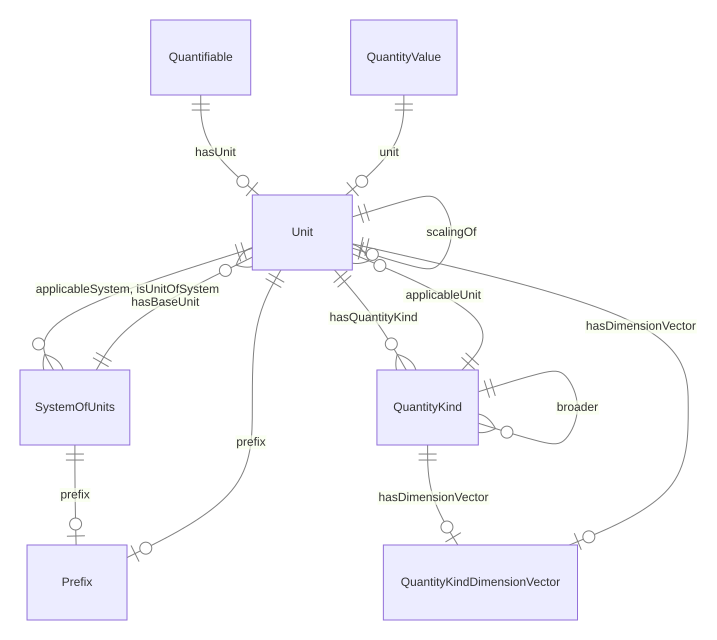

#### Attributes

| Name | Cardinality: | Type | Description |
| --- | --- | --- | --- |
| **[id](#id)** | <sub>1..1</sub> | uri | A unique identifier |
| **[name](#name)** | <sub>0..1</sub> | string | Human-readable label for the entity |
| **[description](#description)** | <sub>0..1</sub> | string | A description of the entity |
| **[abbreviation](#abbreviation)** | <sub>0..1</sub> | string | Short alphanumeric abbreviation for a unit |
| **[deprecated](#deprecated)** | <sub>0..1</sub> | boolean | Whether this entity is deprecated |
| **[plainTextDescription](#plaintextdescription)** | <sub>0..1</sub> | string | Plain text description |
| **[dbpediaMatch](#dbpediamatch)** | <sub>0..1</sub> | uri | DBpedia URI for this entity |
| **[informativeReference](#informativereference)** | <sub>0..\*</sub> | uri | Informative reference URL |
| **[isoNormativeReference](#isonormativereference)** | <sub>0..\*</sub> | uri | ISO normative reference URI |
| **[normativeReference](#normativereference)** | <sub>0..\*</sub> | uri | Normative reference URI |
| **[wikidataMatch](#wikidatamatch)** | <sub>0..1</sub> | uri | Wikidata URI for this entity |
| **[applicableSystem](#applicablesystem)** | <sub>0..\*</sub> | [SystemOfUnits](#systemofunits) | Systems where this unit is applicable |
| **[conversionMultiplier](#conversionmultiplier)** | <sub>0..1</sub> | double | Multiplier to convert to base unit |
| **[conversionOffset](#conversionoffset)** | <sub>0..1</sub> | double | Offset to convert to base unit |
| **[hasDimensionVector](#hasdimensionvector)** | <sub>0..1</sub> | [QuantityKindDimensionVector](#quantitykinddimensionvector) | Dimension vector for a unit or quantity kind |
| **[hasQuantityKind](#hasquantitykind)** | <sub>0..\*</sub> | [QuantityKind](#quantitykind) | Associates a quantity with its kind (e.g., Height, Weight) |
| **[isUnitOfSystem](#isunitofsystem)** | <sub>0..\*</sub> | [SystemOfUnits](#systemofunits) | System of units this unit belongs to |
| **[latexSymbol](#latexsymbol)** | <sub>0..1</sub> | string | LaTeX representation of symbol |
| **[prefix](#prefix)** | <sub>0..1</sub> | [Prefix](#prefix) | Prefix for a unit (e.g., Kilo, Milli) |
| **[scalingOf](#scalingof)** | <sub>0..1</sub> | [Unit](#unit) | Base unit this unit is a scaling of |
| **[symbol](#symbol)** | <sub>0..1</sub> | string | Symbol for a unit (e.g., "m" for meter) |
| **[ucumCode](#ucumcode)** | <sub>0..1</sub> | string | UCUM code for the unit |

#### Parents

 * [Concept](#concept) - The root class for all QUDT concepts

#### Children

 * [DerivedUnit](#derivedunit) - Unit derived from base units (e.g., KiloM)

#### Uses

 *  mixin: [Verifiable](#verifiable) - Holds properties that provide external knowledge and specifications of a given resource

#### Referenced by:

 *  **[QuantityKind](#quantitykind)** : applicableUnit  <sub>0..\*</sub> 
 *  **[SystemOfUnits](#systemofunits)** : hasBaseUnit  <sub>0..\*</sub> 
 *  **[Quantifiable](#quantifiable)** : hasUnit  <sub>0..1</sub> 
 *  **[Unit](#unit)** : scalingOf  <sub>0..1</sub> 
 *  **[QuantityValue](#quantityvalue)** : unit  <sub>0..1</sub> 


## Mixins


### Aspect

An abstract type class that defines properties that can be reused


#### YAML Definition

<details>
<summary>Click to expand</summary>

```yaml
Aspect:
  abstract: true
  mixin: true
  description: An abstract type class that defines properties that can be reused

```
</details>


#### Local class diagram


This class has no attributes


#### Children

 * [Quantifiable](#quantifiable) - Ascribes to some thing the capability of being measured, observed, or counted
 * [Verifiable](#verifiable) - Holds properties that provide external knowledge and specifications of a given resource

### CmykColor

CMYK color space coordinates (0-100).


#### YAML Definition

<details>
<summary>Click to expand</summary>

```yaml
CmykColor:
  mixin: true
  description: CMYK color space coordinates (0-100).
  slots:
  - cmykC
  - cmykM
  - cmykY
  - cmykK

```
</details>


#### Attributes

| Name | Cardinality: | Type | Description |
| --- | --- | --- | --- |
| **[cmykC](#cmykc)** | <sub>0..1</sub> | integer | Cyan component in CMYK color model (0-100) |
| **[cmykK](#cmykk)** | <sub>0..1</sub> | integer | Black (K) component in CMYK color model (0-100) |
| **[cmykM](#cmykm)** | <sub>0..1</sub> | integer | Magenta component in CMYK color model (0-100) |
| **[cmykY](#cmyky)** | <sub>0..1</sub> | integer | Yellow component in CMYK color model (0-100) |

#### Used as mixin by

 * [Color](#color) - Color is the visual perceptual property corresponding in humans to the categories called red, yellow, blue and others.

### Quantifiable

Ascribes to some thing the capability of being measured, observed, or counted


#### YAML Definition

<details>
<summary>Click to expand</summary>

```yaml
Quantifiable:
  is_a: Aspect
  mixin: true
  description: Ascribes to some thing the capability of being measured, observed,
    or counted
  slots:
  - hasUnit
  - standardUncertainty
  - relativeStandardUncertainty

```
</details>


#### Attributes

| Name | Cardinality: | Type | Description |
| --- | --- | --- | --- |
| **[hasUnit](#hasunit)** | <sub>0..1</sub> | [Unit](#unit) | Unit associated with a quantifiable entity |
| **[relativeStandardUncertainty](#relativestandarduncertainty)** | <sub>0..1</sub> | double | Relative standard uncertainty of the measurement |
| **[standardUncertainty](#standarduncertainty)** | <sub>0..1</sub> | decimal | Standard uncertainty of the measurement |

#### Parents

 * [Aspect](#aspect) - An abstract type class that defines properties that can be reused

#### Used as mixin by

 * [Quantity](#quantity) - A measured quantity with kind and value

### Verifiable

Holds properties that provide external knowledge and specifications of a given resource


#### YAML Definition

<details>
<summary>Click to expand</summary>

```yaml
Verifiable:
  is_a: Aspect
  mixin: true
  description: Holds properties that provide external knowledge and specifications
    of a given resource
  slots:
  - dbpediaMatch
  - wikidataMatch
  - informativeReference
  - isoNormativeReference
  - normativeReference

```
</details>


#### Local class diagram


#### Attributes

| Name | Cardinality: | Type | Description |
| --- | --- | --- | --- |
| **[dbpediaMatch](#dbpediamatch)** | <sub>0..1</sub> | uri | DBpedia URI for this entity |
| **[informativeReference](#informativereference)** | <sub>0..\*</sub> | uri | Informative reference URL |
| **[isoNormativeReference](#isonormativereference)** | <sub>0..\*</sub> | uri | ISO normative reference URI |
| **[normativeReference](#normativereference)** | <sub>0..\*</sub> | uri | Normative reference URI |
| **[wikidataMatch](#wikidatamatch)** | <sub>0..1</sub> | uri | Wikidata URI for this entity |

#### Parents

 * [Aspect](#aspect) - An abstract type class that defines properties that can be reused

#### Used as mixin by

 * [Prefix](#prefix) - Unit prefix (e.g., Kilo, Milli)
 * [QuantityKind](#quantitykind) - Kind of quantity (e.g., Length, Mass, Height, Weight)
 * [Unit](#unit) - Unit of measurement

## Slots

| Name | Cardinality/Range | Used By |
| --- | --- | --- |
| <a id="id"></a>**id**<br/>A unique identifier | <sub>1..1</sub><br/>uri | [Ability](#ability), [AbstractQuantityKind](#abstractquantitykind), [BattleItem](#battleitem), [Berry](#berry), [Color](#color), [Concept](#concept), [Connotation](#connotation), [DecimalPrefix](#decimalprefix), [DerivedUnit](#derivedunit), [EggGroup](#egggroup), [Flavor](#flavor), [Food](#food), [Game](#game), [Generation](#generation), [Gym](#gym), [GymLeader](#gymleader), [HM](#hm), [Habitat](#habitat), [HoldItem](#holditem), [Item](#item), [Medicine](#medicine), [Move](#move), [NamedIndividual](#namedindividual), [Person](#person), [PhysicalMove](#physicalmove), [Place](#place), [Pokeball](#pokeball), [Pokedex](#pokedex), [PokedexEntry](#pokedexentry), [Prefix](#prefix), [Quantity](#quantity), [QuantityKind](#quantitykind), [QuantityKindDimensionVector](#quantitykinddimensionvector), [QuantityKindDimensionVectorCGS](#quantitykinddimensionvectorcgs), [QuantityKindDimensionVectorISO](#quantitykinddimensionvectoriso), [QuantityKindDimensionVectorImperial](#quantitykinddimensionvectorimperial), [QuantityKindDimensionVectorSI](#quantitykinddimensionvectorsi), [QuantityValue](#quantityvalue), [Region](#region), [Shape](#shape), [SpecialMove](#specialmove), [Species](#species), [StatusMove](#statusmove), [SystemOfUnits](#systemofunits), [TM](#tm), [Thing](#thing), [Town](#town), [Trainer](#trainer), [Type](#type), [Unit](#unit) |
| <a id="name"></a>**name**<br/>Human-readable label for the entity | <sub>0..1</sub><br/>string | [Ability](#ability), [AbstractQuantityKind](#abstractquantitykind), [BattleItem](#battleitem), [Berry](#berry), [Color](#color), [Concept](#concept), [Connotation](#connotation), [DecimalPrefix](#decimalprefix), [DerivedUnit](#derivedunit), [EggGroup](#egggroup), [Flavor](#flavor), [Food](#food), [Game](#game), [Generation](#generation), [Gym](#gym), [GymLeader](#gymleader), [HM](#hm), [Habitat](#habitat), [HoldItem](#holditem), [Item](#item), [Medicine](#medicine), [Move](#move), [NamedIndividual](#namedindividual), [Person](#person), [PhysicalMove](#physicalmove), [Place](#place), [Pokeball](#pokeball), [Pokedex](#pokedex), [PokedexEntry](#pokedexentry), [Prefix](#prefix), [Quantity](#quantity), [QuantityKind](#quantitykind), [QuantityKindDimensionVector](#quantitykinddimensionvector), [QuantityKindDimensionVectorCGS](#quantitykinddimensionvectorcgs), [QuantityKindDimensionVectorISO](#quantitykinddimensionvectoriso), [QuantityKindDimensionVectorImperial](#quantitykinddimensionvectorimperial), [QuantityKindDimensionVectorSI](#quantitykinddimensionvectorsi), [QuantityValue](#quantityvalue), [Region](#region), [Shape](#shape), [SpecialMove](#specialmove), [Species](#species), [StatusMove](#statusmove), [SystemOfUnits](#systemofunits), [TM](#tm), [Thing](#thing), [Town](#town), [Trainer](#trainer), [Type](#type), [Unit](#unit) |
| <a id="description"></a>**description**<br/>A description of the entity | <sub>0..1</sub><br/>string | [Ability](#ability), [AbstractQuantityKind](#abstractquantitykind), [BattleItem](#battleitem), [Berry](#berry), [Color](#color), [Concept](#concept), [Connotation](#connotation), [DecimalPrefix](#decimalprefix), [DerivedUnit](#derivedunit), [EggGroup](#egggroup), [Flavor](#flavor), [Food](#food), [Game](#game), [Generation](#generation), [Gym](#gym), [GymLeader](#gymleader), [HM](#hm), [Habitat](#habitat), [HoldItem](#holditem), [Item](#item), [Medicine](#medicine), [Move](#move), [NamedIndividual](#namedindividual), [Person](#person), [PhysicalMove](#physicalmove), [Place](#place), [Pokeball](#pokeball), [Pokedex](#pokedex), [PokedexEntry](#pokedexentry), [Prefix](#prefix), [Quantity](#quantity), [QuantityKind](#quantitykind), [QuantityKindDimensionVector](#quantitykinddimensionvector), [QuantityKindDimensionVectorCGS](#quantitykinddimensionvectorcgs), [QuantityKindDimensionVectorISO](#quantitykinddimensionvectoriso), [QuantityKindDimensionVectorImperial](#quantitykinddimensionvectorimperial), [QuantityKindDimensionVectorSI](#quantitykinddimensionvectorsi), [QuantityValue](#quantityvalue), [Region](#region), [Shape](#shape), [SpecialMove](#specialmove), [Species](#species), [StatusMove](#statusmove), [SystemOfUnits](#systemofunits), [TM](#tm), [Thing](#thing), [Town](#town), [Trainer](#trainer), [Type](#type), [Unit](#unit) |
| <a id="connotation_name"></a>**Connotation_name**<br/>Human-readable label for the entity | <sub>1..1</sub><br/>string |  |
| <a id="namedindividual_name"></a>**NamedIndividual_name**<br/>Human-readable label for the entity | <sub>1..1</sub><br/>string |  |
| <a id="abbreviation"></a>**abbreviation**<br/>Short alphanumeric abbreviation for a unit | <sub>0..1</sub><br/>string | [AbstractQuantityKind](#abstractquantitykind), [Concept](#concept), [DecimalPrefix](#decimalprefix), [DerivedUnit](#derivedunit), [Prefix](#prefix), [Quantity](#quantity), [QuantityKind](#quantitykind), [QuantityKindDimensionVector](#quantitykinddimensionvector), [QuantityKindDimensionVectorCGS](#quantitykinddimensionvectorcgs), [QuantityKindDimensionVectorISO](#quantitykinddimensionvectoriso), [QuantityKindDimensionVectorImperial](#quantitykinddimensionvectorimperial), [QuantityKindDimensionVectorSI](#quantitykinddimensionvectorsi), [QuantityValue](#quantityvalue), [SystemOfUnits](#systemofunits), [Unit](#unit) |
| <a id="accuracy"></a>**accuracy**<br/>Chance of a move successfully hitting the target, as a percentage. | <sub>0..1</sub><br/>integer |  |
| <a id="applicablesystem"></a>**applicableSystem**<br/>Systems where this unit is applicable | <sub>0..\*</sub><br/>[SystemOfUnits](#systemofunits) | [DerivedUnit](#derivedunit), [Unit](#unit) |
| <a id="applicableunit"></a>**applicableUnit**<br/>Units applicable to a quantity kind | <sub>0..\*</sub><br/>[Unit](#unit) | [QuantityKind](#quantitykind) |
| <a id="basepower"></a>**basePower**<br/>Base damage output of a move before applying type effectiveness and stat modifiers. | <sub>0..1</sub><br/>integer |  |
| <a id="basepowerpoints"></a>**basePowerPoints**<br/>Starting number of times a move can be used before needing restoration. | <sub>0..1</sub><br/>integer |  |
| <a id="broader"></a>**broader**<br/>Broader/parent quantity kind | <sub>0..\*</sub><br/>[QuantityKind](#quantitykind) | [AbstractQuantityKind](#abstractquantitykind), [QuantityKind](#quantitykind) |
| <a id="cmykc"></a>**cmykC**<br/>Cyan component in CMYK color model (0-100) | <sub>0..1</sub><br/>integer | [CmykColor](#cmykcolor), [Color](#color) |
| <a id="cmykk"></a>**cmykK**<br/>Black (K) component in CMYK color model (0-100) | <sub>0..1</sub><br/>integer | [CmykColor](#cmykcolor), [Color](#color) |
| <a id="cmykm"></a>**cmykM**<br/>Magenta component in CMYK color model (0-100) | <sub>0..1</sub><br/>integer | [CmykColor](#cmykcolor), [Color](#color) |
| <a id="cmyky"></a>**cmykY**<br/>Yellow component in CMYK color model (0-100) | <sub>0..1</sub><br/>integer | [CmykColor](#cmykcolor), [Color](#color) |
| <a id="colorhexcode"></a>**colorHexCode**<br/>Hexadecimal RGB color code (e.g., "0000FF" for blue) | <sub>0..1</sub><br/>string | [Color](#color) |
| <a id="connotation"></a>**connotation**<br/>Cultural or symbolic meanings associated with this color | <sub>0..\*</sub><br/>[Connotation](#connotation) | [Color](#color) |
| <a id="containsplace"></a>**containsPlace**<br/>A place is contained to some extent in this place. | <sub>0..\*</sub><br/>[Place](#place) |  |
| <a id="conversionmultiplier"></a>**conversionMultiplier**<br/>Multiplier to convert to base unit | <sub>0..1</sub><br/>double | [DerivedUnit](#derivedunit), [Unit](#unit) |
| <a id="conversionoffset"></a>**conversionOffset**<br/>Offset to convert to base unit | <sub>0..1</sub><br/>double | [DerivedUnit](#derivedunit), [Unit](#unit) |
| <a id="dbpediamatch"></a>**dbpediaMatch**<br/>DBpedia URI for this entity | <sub>0..1</sub><br/>uri | [DecimalPrefix](#decimalprefix), [DerivedUnit](#derivedunit), [Prefix](#prefix), [QuantityKind](#quantitykind), [Unit](#unit), [Verifiable](#verifiable) |
| <a id="depiction"></a>**depiction**<br/>A depiction of the person | <sub>0..1</sub><br/>string | [GymLeader](#gymleader), [Person](#person), [Species](#species), [Trainer](#trainer) |
| <a id="deprecated"></a>**deprecated**<br/>Whether this entity is deprecated | <sub>0..1</sub><br/>boolean | [AbstractQuantityKind](#abstractquantitykind), [Concept](#concept), [DecimalPrefix](#decimalprefix), [DerivedUnit](#derivedunit), [Prefix](#prefix), [Quantity](#quantity), [QuantityKind](#quantitykind), [QuantityKindDimensionVector](#quantitykinddimensionvector), [QuantityKindDimensionVectorCGS](#quantitykinddimensionvectorcgs), [QuantityKindDimensionVectorISO](#quantitykinddimensionvectoriso), [QuantityKindDimensionVectorImperial](#quantitykinddimensionvectorimperial), [QuantityKindDimensionVectorSI](#quantitykinddimensionvectorsi), [QuantityValue](#quantityvalue), [SystemOfUnits](#systemofunits), [Unit](#unit) |
| <a id="describedinpokedex"></a>**describedInPokedex**<br/>['A Pokédex entry is described in a Pokédex'] | <sub>0..\*</sub><br/>[PokedexEntry](#pokedexentry) |  |
| <a id="describespokemon"></a>**describesPokemon**<br/>A Pokémon that is described by this Pokédex entry. | <sub>0..\*</sub><br/>[Species](#species) |  |
| <a id="dimensionexponentforamountofsubstance"></a>**dimensionExponentForAmountOfSubstance**<br/>Exponent for amount of substance dimension (N) | <sub>0..1</sub><br/>integer | [QuantityKindDimensionVector](#quantitykinddimensionvector), [QuantityKindDimensionVectorCGS](#quantitykinddimensionvectorcgs), [QuantityKindDimensionVectorISO](#quantitykinddimensionvectoriso), [QuantityKindDimensionVectorImperial](#quantitykinddimensionvectorimperial), [QuantityKindDimensionVectorSI](#quantitykinddimensionvectorsi) |
| <a id="dimensionexponentforelectriccurrent"></a>**dimensionExponentForElectricCurrent**<br/>Exponent for electric current dimension (I) | <sub>0..1</sub><br/>integer | [QuantityKindDimensionVector](#quantitykinddimensionvector), [QuantityKindDimensionVectorCGS](#quantitykinddimensionvectorcgs), [QuantityKindDimensionVectorISO](#quantitykinddimensionvectoriso), [QuantityKindDimensionVectorImperial](#quantitykinddimensionvectorimperial), [QuantityKindDimensionVectorSI](#quantitykinddimensionvectorsi) |
| <a id="dimensionexponentforlength"></a>**dimensionExponentForLength**<br/>Exponent for length dimension (L) | <sub>0..1</sub><br/>integer | [QuantityKindDimensionVector](#quantitykinddimensionvector), [QuantityKindDimensionVectorCGS](#quantitykinddimensionvectorcgs), [QuantityKindDimensionVectorISO](#quantitykinddimensionvectoriso), [QuantityKindDimensionVectorImperial](#quantitykinddimensionvectorimperial), [QuantityKindDimensionVectorSI](#quantitykinddimensionvectorsi) |
| <a id="dimensionexponentforluminousintensity"></a>**dimensionExponentForLuminousIntensity**<br/>Exponent for luminous intensity dimension (J) | <sub>0..1</sub><br/>integer | [QuantityKindDimensionVector](#quantitykinddimensionvector), [QuantityKindDimensionVectorCGS](#quantitykinddimensionvectorcgs), [QuantityKindDimensionVectorISO](#quantitykinddimensionvectoriso), [QuantityKindDimensionVectorImperial](#quantitykinddimensionvectorimperial), [QuantityKindDimensionVectorSI](#quantitykinddimensionvectorsi) |
| <a id="dimensionexponentformass"></a>**dimensionExponentForMass**<br/>Exponent for mass dimension (M) | <sub>0..1</sub><br/>integer | [QuantityKindDimensionVector](#quantitykinddimensionvector), [QuantityKindDimensionVectorCGS](#quantitykinddimensionvectorcgs), [QuantityKindDimensionVectorISO](#quantitykinddimensionvectoriso), [QuantityKindDimensionVectorImperial](#quantitykinddimensionvectorimperial), [QuantityKindDimensionVectorSI](#quantitykinddimensionvectorsi) |
| <a id="dimensionexponentforthermodynamictemperature"></a>**dimensionExponentForThermodynamicTemperature**<br/>Exponent for temperature dimension (Θ) | <sub>0..1</sub><br/>integer | [QuantityKindDimensionVector](#quantitykinddimensionvector), [QuantityKindDimensionVectorCGS](#quantitykinddimensionvectorcgs), [QuantityKindDimensionVectorISO](#quantitykinddimensionvectoriso), [QuantityKindDimensionVectorImperial](#quantitykinddimensionvectorimperial), [QuantityKindDimensionVectorSI](#quantitykinddimensionvectorsi) |
| <a id="dimensionexponentfortime"></a>**dimensionExponentForTime**<br/>Exponent for time dimension (T) | <sub>0..1</sub><br/>integer | [QuantityKindDimensionVector](#quantitykinddimensionvector), [QuantityKindDimensionVectorCGS](#quantitykinddimensionvectorcgs), [QuantityKindDimensionVectorISO](#quantitykinddimensionvectoriso), [QuantityKindDimensionVectorImperial](#quantitykinddimensionvectorimperial), [QuantityKindDimensionVectorSI](#quantitykinddimensionvectorsi) |
| <a id="dimensionlessexponent"></a>**dimensionlessExponent**<br/>Dimensionless exponent | <sub>0..1</sub><br/>integer | [QuantityKindDimensionVector](#quantitykinddimensionvector), [QuantityKindDimensionVectorCGS](#quantitykinddimensionvectorcgs), [QuantityKindDimensionVectorISO](#quantitykinddimensionvectoriso), [QuantityKindDimensionVectorImperial](#quantitykinddimensionvectorimperial), [QuantityKindDimensionVectorSI](#quantitykinddimensionvectorsi) |
| <a id="effectdescription"></a>**effectDescription**<br/>A description of the effect of the entity | <sub>0..\*</sub><br/>string | [Ability](#ability), [Move](#move), [PhysicalMove](#physicalmove), [SpecialMove](#specialmove), [StatusMove](#statusmove) |
| <a id="entrynumber"></a>**entryNumber**<br/>The unique number identifying this entry within a Pokédex. | <sub>0..1</sub><br/>integer |  |
| <a id="evolvesfrom"></a>**evolvesFrom**<br/>This species evolves the other species. | <sub>0..1</sub><br/>[Species](#species) |  |
| <a id="evolvesto"></a>**evolvesTo**<br/>A Pokémon evolves to another Pokémon. | <sub>0..\*</sub><br/>[Species](#species) |  |
| <a id="exactmatch"></a>**exactMatch**<br/>Equivalent quantity kind or unit | <sub>0..\*</sub><br/>string | [DecimalPrefix](#decimalprefix), [Prefix](#prefix), [QuantityKind](#quantitykind) |
| <a id="featuresspecies"></a>**featuresSpecies**<br/>['A Pokédex entry features a species'] | <sub>0..\*</sub><br/>[Species](#species) | [Generation](#generation) |
| <a id="firmness"></a>**firmness**<br/>How firm a berry or food item feels, affecting its use in Pokéblock or Poffin making. | <sub>0..1</sub><br/>integer | [Berry](#berry), [Food](#food) |
| <a id="foundin"></a>**foundIn**<br/>A place is found in a location | <sub>0..\*</sub><br/>[Habitat](#habitat) | [Species](#species) |
| <a id="frequency"></a>**frequency**<br/>The frequency of the color in Hz | <sub>0..1</sub><br/>float | [Color](#color) |
| <a id="hasbaseunit"></a>**hasBaseUnit**<br/>Base units defined by this system | <sub>0..\*</sub><br/>[Unit](#unit) | [SystemOfUnits](#systemofunits) |
| <a id="hascatchrate"></a>**hasCatchRate**<br/>Determines how easy a Pokémon species is to catch, with higher values meaning easier capture. | <sub>0..1</sub><br/>integer | [Species](#species) |
| <a id="hascolor"></a>**hasColor**<br/>A Pokémon has a color | <sub>0..1</sub><br/>[Color](#color) | [Species](#species) |
| <a id="hasdimensionvector"></a>**hasDimensionVector**<br/>Dimension vector for a unit or quantity kind | <sub>0..1</sub><br/>[QuantityKindDimensionVector](#quantitykinddimensionvector) | [DerivedUnit](#derivedunit), [QuantityKind](#quantitykind), [Unit](#unit) |
| <a id="hasflavor"></a>**hasFlavor**<br/>A Pokémon has a flavor | <sub>0..\*</sub><br/>[Flavor](#flavor) | [Berry](#berry), [Food](#food) |
| <a id="hasgenus"></a>**hasGenus**<br/>The species category label shown in the Pokédex, such as "Seed Pokémon" for Bulbasaur. | <sub>0..1</sub><br/>string | [Species](#species) |
| <a id="hasheight"></a>**hasHeight**<br/>How tall a Pokémon species is, expressed as a quantity with unit. | <sub>0..1</sub><br/>[Quantity](#quantity) | [Species](#species) |
| <a id="haspokedexentry"></a>**hasPokedexEntry**<br/>A Pokédex entry in which this Pokémon is described. | <sub>0..\*</sub><br/>[PokedexEntry](#pokedexentry) |  |
| <a id="hasquantitykind"></a>**hasQuantityKind**<br/>Associates a quantity with its kind (e.g., Height, Weight) | <sub>0..\*</sub><br/>[QuantityKind](#quantitykind) | [DerivedUnit](#derivedunit), [Quantity](#quantity), [Unit](#unit) |
| <a id="hasshape"></a>**hasShape**<br/>The shape of a berry is a measure of how good it is for making a Potion. | <sub>0..1</sub><br/>[Shape](#shape) | [Species](#species) |
| <a id="hassize"></a>**hasSize**<br/>The physical size of an entity, expressed as a quantity with unit. | <sub>0..1</sub><br/>[Quantity](#quantity) | [Berry](#berry) |
| <a id="hastype"></a>**hasType**<br/>A Pokémon has a type | <sub>0..\*</sub><br/>[Type](#type) | [Move](#move), [PhysicalMove](#physicalmove), [SpecialMove](#specialmove), [Species](#species), [StatusMove](#statusmove) |
| <a id="hasunit"></a>**hasUnit**<br/>Unit associated with a quantifiable entity | <sub>0..1</sub><br/>[Unit](#unit) | [Quantifiable](#quantifiable), [Quantity](#quantity) |
| <a id="hasweight"></a>**hasWeight**<br/>How heavy a Pokémon species is, expressed as a quantity with unit. | <sub>0..1</sub><br/>[Quantity](#quantity) | [Species](#species) |
| <a id="inegggroup"></a>**inEggGroup**<br/>Which egg group a species belongs to, controlling which Pokémon can breed together. | <sub>0..\*</sub><br/>[EggGroup](#egggroup) | [Species](#species) |
| <a id="informativereference"></a>**informativeReference**<br/>Informative reference URL | <sub>0..\*</sub><br/>uri | [DecimalPrefix](#decimalprefix), [DerivedUnit](#derivedunit), [Prefix](#prefix), [QuantityKind](#quantitykind), [Unit](#unit), [Verifiable](#verifiable) |
| <a id="isabletoapply"></a>**isAbleToApply**<br/>Moves that a Pokémon can use in battle or in the overworld. | <sub>0..\*</sub><br/>[Move](#move) | [Species](#species) |
| <a id="isunitofsystem"></a>**isUnitOfSystem**<br/>System of units this unit belongs to | <sub>0..\*</sub><br/>[SystemOfUnits](#systemofunits) | [DerivedUnit](#derivedunit), [Unit](#unit) |
| <a id="isonormativereference"></a>**isoNormativeReference**<br/>ISO normative reference URI | <sub>0..\*</sub><br/>uri | [DecimalPrefix](#decimalprefix), [DerivedUnit](#derivedunit), [Prefix](#prefix), [QuantityKind](#quantitykind), [Unit](#unit), [Verifiable](#verifiable) |
| <a id="latexsymbol"></a>**latexSymbol**<br/>LaTeX representation of symbol | <sub>0..1</sub><br/>string | [DerivedUnit](#derivedunit), [QuantityKind](#quantitykind), [QuantityKindDimensionVector](#quantitykinddimensionvector), [QuantityKindDimensionVectorCGS](#quantitykinddimensionvectorcgs), [QuantityKindDimensionVectorISO](#quantitykinddimensionvectoriso), [QuantityKindDimensionVectorImperial](#quantitykinddimensionvectorimperial), [QuantityKindDimensionVectorSI](#quantitykinddimensionvectorsi), [Unit](#unit) |
| <a id="learnsmove"></a>**learnsMove**<br/>The move acquired through this particular learning method. | <sub>0..\*</sub><br/>[Move](#move) |  |
| <a id="locatedin"></a>**locatedIn**<br/>This place is located to some extent in another place. | <sub>0..\*</sub><br/>[Place](#place) |  |
| <a id="maxpowerpoints"></a>**maxPowerPoints**<br/>Maximum times a move can be used after PP-enhancing items are applied. | <sub>0..1</sub><br/>integer |  |
| <a id="mayhaveability"></a>**mayHaveAbility**<br/>A Pokémon may have an ability | <sub>0..\*</sub><br/>[Ability](#ability) | [Species](#species) |
| <a id="mayhavehiddenability"></a>**mayHaveHiddenAbility**<br/>A special ability only obtainable through specific encounters or events, not through normal gameplay. | <sub>0..\*</sub><br/>[Ability](#ability) | [Species](#species) |
| <a id="minleveltolearn"></a>**minLevelToLearn**<br/>The minimum level a Pokémon needs to reach to learn this move. | <sub>0..1</sub><br/>integer |  |
| <a id="normativereference"></a>**normativeReference**<br/>Normative reference URI | <sub>0..\*</sub><br/>uri | [DecimalPrefix](#decimalprefix), [DerivedUnit](#derivedunit), [Prefix](#prefix), [QuantityKind](#quantitykind), [Unit](#unit), [Verifiable](#verifiable) |
| <a id="numericvalue"></a>**numericValue**<br/>Numeric value of a quantity | <sub>0..1</sub><br/>double | [QuantityValue](#quantityvalue) |
| <a id="plaintextdescription"></a>**plainTextDescription**<br/>Plain text description | <sub>0..1</sub><br/>string | [AbstractQuantityKind](#abstractquantitykind), [Concept](#concept), [DecimalPrefix](#decimalprefix), [DerivedUnit](#derivedunit), [Prefix](#prefix), [Quantity](#quantity), [QuantityKind](#quantitykind), [QuantityKindDimensionVector](#quantitykinddimensionvector), [QuantityKindDimensionVectorCGS](#quantitykinddimensionvectorcgs), [QuantityKindDimensionVectorISO](#quantitykinddimensionvectoriso), [QuantityKindDimensionVectorImperial](#quantitykinddimensionvectorimperial), [QuantityKindDimensionVectorSI](#quantitykinddimensionvectorsi), [QuantityValue](#quantityvalue), [SystemOfUnits](#systemofunits), [Unit](#unit) |
| <a id="prefix"></a>**prefix**<br/>Prefix for a unit (e.g., Kilo, Milli) | <sub>0..1</sub><br/>[Prefix](#prefix) | [DerivedUnit](#derivedunit), [SystemOfUnits](#systemofunits), [Unit](#unit) |
| <a id="prefixmultiplier"></a>**prefixMultiplier**<br/>Numeric multiplier for the prefix (e.g., 1000 for Kilo) | <sub>0..1</sub><br/>double | [DecimalPrefix](#decimalprefix), [Prefix](#prefix) |
| <a id="quantityvalue"></a>**quantityValue**<br/>The value component of a quantity | <sub>0..\*</sub><br/>[QuantityValue](#quantityvalue) | [Quantity](#quantity) |
| <a id="relativestandarduncertainty"></a>**relativeStandardUncertainty**<br/>Relative standard uncertainty of the measurement | <sub>0..1</sub><br/>double | [Quantifiable](#quantifiable), [Quantity](#quantity) |
| <a id="scalingof"></a>**scalingOf**<br/>Base unit this unit is a scaling of | <sub>0..1</sub><br/>[Unit](#unit) | [DerivedUnit](#derivedunit), [Unit](#unit) |
| <a id="smoothness"></a>**smoothness**<br/>How smooth a berry or food item is, affecting its use in Pokéblock or Poffin making. | <sub>0..1</sub><br/>integer | [Berry](#berry), [Food](#food) |
| <a id="standarduncertainty"></a>**standardUncertainty**<br/>Standard uncertainty of the measurement | <sub>0..1</sub><br/>decimal | [Quantifiable](#quantifiable), [Quantity](#quantity) |
| <a id="symbol"></a>**symbol**<br/>Symbol for a unit (e.g., "m" for meter) | <sub>0..1</sub><br/>string | [AbstractQuantityKind](#abstractquantitykind), [DecimalPrefix](#decimalprefix), [DerivedUnit](#derivedunit), [Prefix](#prefix), [QuantityKind](#quantitykind), [Unit](#unit) |
| <a id="thumbnail"></a>**thumbnail**<br/>URL to a representative image of this color | <sub>0..1</sub><br/>uri | [Color](#color) |
| <a id="ucumcode"></a>**ucumCode**<br/>UCUM code for the unit | <sub>0..1</sub><br/>string | [DecimalPrefix](#decimalprefix), [DerivedUnit](#derivedunit), [Prefix](#prefix), [Unit](#unit) |
| <a id="unit"></a>**unit**<br/>Unit of measurement | <sub>0..1</sub><br/>[Unit](#unit) | [QuantityValue](#quantityvalue) |
| <a id="wavelength"></a>**wavelength**<br/>The wavelength of the color in meters (e.g., 4.5e-07 for blue) | <sub>0..1</sub><br/>float | [Color](#color) |
| <a id="wikidatamatch"></a>**wikidataMatch**<br/>Wikidata URI for this entity | <sub>0..1</sub><br/>uri | [DecimalPrefix](#decimalprefix), [DerivedUnit](#derivedunit), [Prefix](#prefix), [QuantityKind](#quantitykind), [Unit](#unit), [Verifiable](#verifiable) |

## Enums


### HabitatEnum


| Text | Meaning: | Description |
| --- | --- | --- |
| Cave | pokemon:Habitat_Cave | A hollow underground area, typically formed in rocky or mountainous terrain. |
| Forest | pokemon:Habitat_Forest | A dense area covered with trees and undergrowth. |
| Grassland | pokemon:Habitat_Grassland | An open area of land covered predominantly with grasses and low vegetation. |
| Mountain | pokemon:Habitat_Mountain | A large elevated landform rising steeply above the surrounding terrain. |
| Rare | pokemon:Habitat_Rare | An uncommon or hard-to-reach environment with no single fixed location. |
| Rough terrain | pokemon:Habitat_RoughTerrain | Harsh, uneven landscape such as deserts, volcanic areas, or rocky wastelands. |
| Sea | pokemon:Habitat_Sea | Open deep water far from shore, including oceans and large lakes. |
| Urban | pokemon:Habitat_Urban | A densely developed area with buildings, roads, and other human-made structures. |
| Water's edge | pokemon:Habitat_WatersEdge | The transitional zone where land meets water, including shorelines, riverbanks, and wetlands. |

