# LINKML-POKEMON


**metamodel version:** 1.7.0

**version:** None


Ontology covering the Pokémon world as it is presented in games and anime television series


## Class Diagram

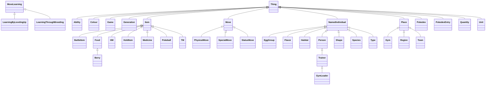

## ERD Diagrams


### Component 1 (Ability, Colour, EggGroup...)

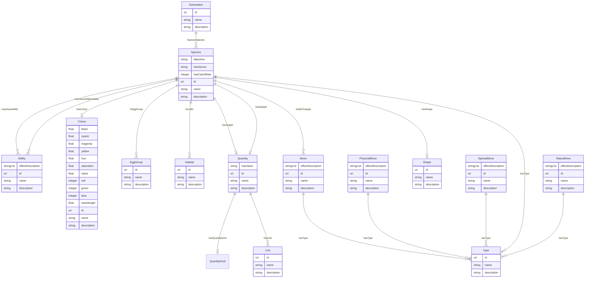


### Component 2 (Berry, Flavor, Food)

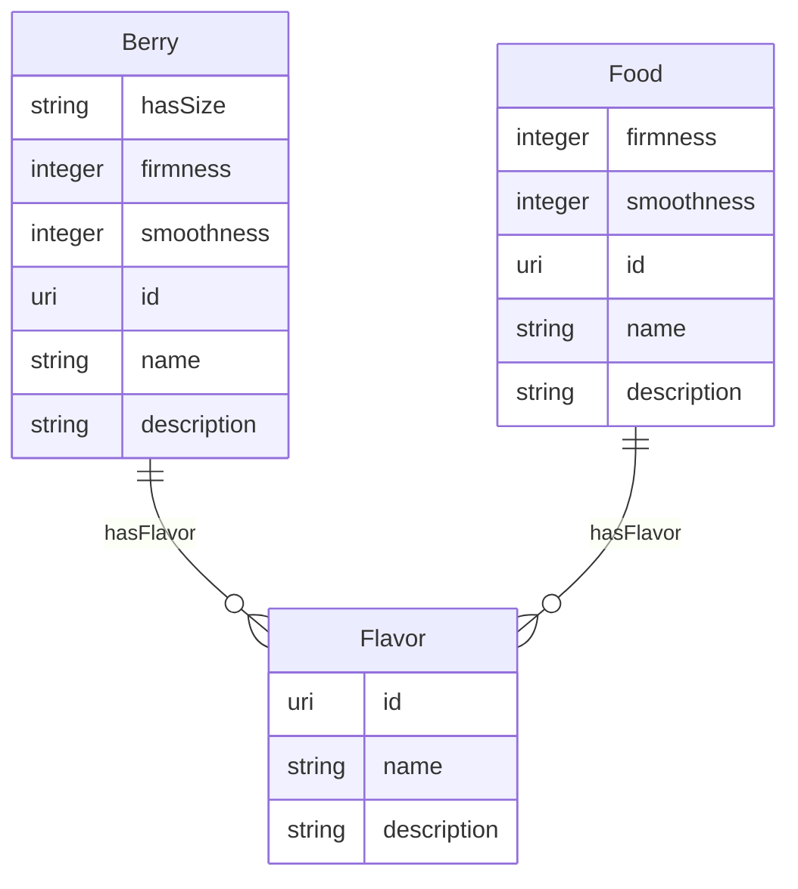


## Base Classes


These classes have no direct relationships but serve as base classes for other classes:

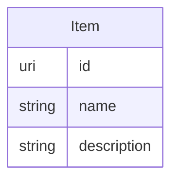


## Standalone Classes


These classes are completely isolated with no relationships and are not used as base classes:

```mermaid
erDiagram
BattleItem {
    uri id  
    string name  
    string description  
}
Game {
    uri id  
    string name  
    string description  
}
Gym {
    uri id  
    string name  
    string description  
}
GymLeader {
    string depiction  
    uri id  
    string name  
    string description  
}
HM {
    uri id  
    string name  
    string description  
}
HoldItem {
    uri id  
    string name  
    string description  
}
LearningByLevelingUp {

}
LearningThroughBreeding {

}
Medicine {
    uri id  
    string name  
    string description  
}
MoveLearning {

}
Person {
    string depiction  
    uri id  
    string name  
    string description  
}
Pokeball {
    uri id  
    string name  
    string description  
}
Pokedex {
    uri id  
    string name  
    string description  
}
PokedexEntry {
    uri id  
    string name  
    string description  
}
Pokemon {

}
Region {
    uri id  
    string name  
    string description  
}
TM {
    uri id  
    string name  
    string description  
}
Town {
    uri id  
    string name  
    string description  
}
Trainer {
    string depiction  
    uri id  
    string name  
    string description  
}



```


## Abstract Classes


### NamedIndividual

A Thing that requires a name


#### Local class diagram

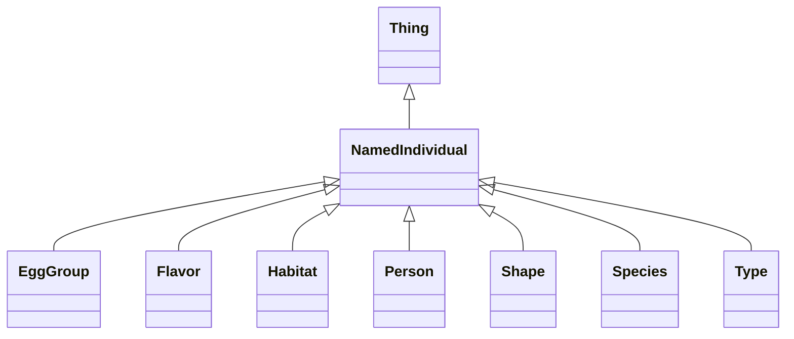

#### Attributes

| Name | Cardinality: | Type | Description |
| --- | --- | --- | --- |
| id | <sub>1..1</sub> | uri | A unique identifier |
| name | <sub>1..1</sub> | string | Human-readable label for the entity |
| description | <sub>0..1</sub> | string | A description of the entity |

#### Parents

 * [Thing](#Thing) - An rdfs:Resource that defines name and description

#### Children

 * [EggGroup](#EggGroup)
 * [Flavor](#Flavor)
 * [Habitat](#Habitat) - A habitat is a type of environment that certain Pokemon belong to.
 * [Person](#Person) - A person is a human being
 * [Shape](#Shape) - Shapes are categories that certain Pokemon belong to, which determine which Pokemon they can breed with.
 * [Species](#Species) - A species is a category of Pokemon that share common features.
 * [Type](#Type)

#### Referenced by:


### Place


#### Local class diagram

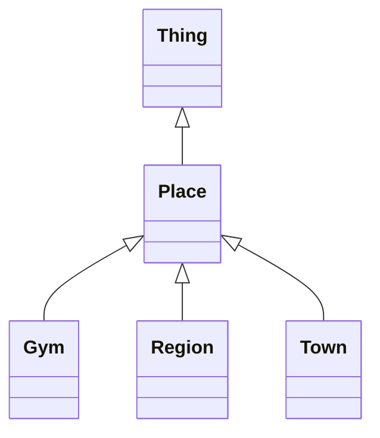

#### Attributes

| Name | Cardinality: | Type | Description |
| --- | --- | --- | --- |
| id | <sub>1..1</sub> | uri | A unique identifier |
| name | <sub>0..1</sub> | string | Human-readable label for the entity |
| description | <sub>0..1</sub> | string | A description of the entity |

#### Parents

 * [Thing](#Thing) - An rdfs:Resource that defines name and description

#### Children

 * [Gym](#Gym) - A gym is a location that can be battled at.
 * [Region](#Region)
 * [Town](#Town) - A town is a type of place that can be visited.

#### Referenced by:


### Thing

An rdfs:Resource that defines name and description


#### Local class diagram

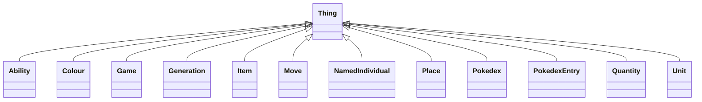

#### Attributes

| Name | Cardinality: | Type | Description |
| --- | --- | --- | --- |
| **id** | <sub>1..1</sub> | uri | A unique identifier |
| **name** | <sub>0..1</sub> | string | Human-readable label for the entity |
| **description** | <sub>0..1</sub> | string | A description of the entity |

#### Children

 * [Ability](#Ability)
 * [Colour](#Colour) - Color or colour is the visual perceptual property corresponding in humans to the categories called red, yellow, blue and others.
 * [Game](#Game) - A game is a type of media that can be played by people.
 * [Generation](#Generation)
 * [Item](#Item)
 * [Move](#Move)
 * [NamedIndividual](#NamedIndividual) - A Thing that requires a name
 * [Place](#Place)
 * [Pokedex](#Pokedex)
 * [PokedexEntry](#PokedexEntry) - A pokedex entry is a description of a Pokemon.
 * [Quantity](#Quantity) - A physical quantity.
 * [Unit](#Unit) - A unit of measure.


## Classes


### Ability


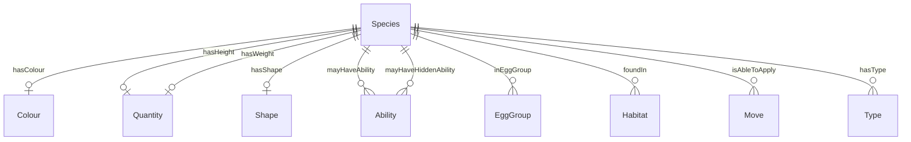


#### Attributes

| Name | Cardinality: | Type | Description |
| --- | --- | --- | --- |
| id | <sub>1..1</sub> | uri | A unique identifier |
| name | <sub>0..1</sub> | string | Human-readable label for the entity |
| description | <sub>0..1</sub> | string | A description of the entity |
| **effectDescription** | <sub>0..\*</sub> | string | A description of the effect of the entity |

#### Parents

 * [Thing](#Thing) - An rdfs:Resource that defines name and description

#### Referenced by:

 *  **[Species](#Species)** : *[mayHaveAbility](#mayHaveAbility)*  <sub>0..\*</sub> 
 *  **[Species](#Species)** : *[mayHaveHiddenAbility](#mayHaveHiddenAbility)*  <sub>0..\*</sub> 


### BattleItem

Battle items are items that can be used during battles.


#### Local class diagram

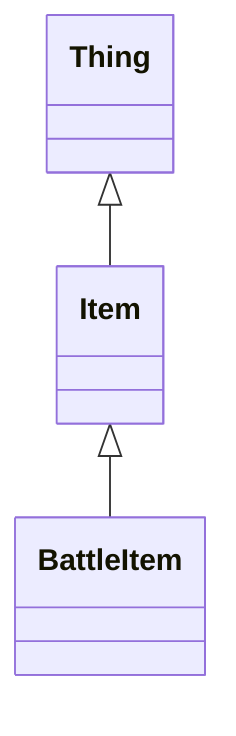

#### Attributes

| Name | Cardinality: | Type | Description |
| --- | --- | --- | --- |
| id | <sub>1..1</sub> | uri | A unique identifier |
| name | <sub>0..1</sub> | string | Human-readable label for the entity |
| description | <sub>0..1</sub> | string | A description of the entity |

#### Parents

 * [Item](#Item)


### Berry


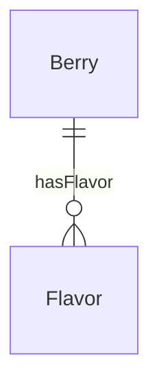


#### Attributes

| Name | Cardinality: | Type | Description |
| --- | --- | --- | --- |
| id | <sub>1..1</sub> | uri | A unique identifier |
| name | <sub>0..1</sub> | string | Human-readable label for the entity |
| description | <sub>0..1</sub> | string | A description of the entity |
| firmness | <sub>0..1</sub> | integer |  |
| hasFlavor | <sub>0..\*</sub> | [Flavor](#Flavor) | A Pokemon has a flavor |
| smoothness | <sub>0..1</sub> | integer |  |
| **hasSize** | <sub>0..1</sub> | string |  |

#### Parents

 * [Food](#Food)


### Colour

Color or colour is the visual perceptual property corresponding in humans to the categories called red, yellow, blue and others.


#### Attributes

| Name | Cardinality: | Type | Description |
| --- | --- | --- | --- |
| id | <sub>1..1</sub> | uri | A unique identifier |
| name | <sub>0..1</sub> | string | Human-readable label for the entity |
| description | <sub>0..1</sub> | string | A description of the entity |
| **black** | <sub>0..1</sub> | float | Black component in CMYK color model |
| **blue** | <sub>0..1</sub> | integer | Blue component in RGB color model (0-255) |
| **cyanic** | <sub>0..1</sub> | float | Cyan component in CMYK color model |
| **green** | <sub>0..1</sub> | integer | Green component in RGB color model (0-255) |
| **hue** | <sub>0..1</sub> | float | Hue component in HSV color model |
| **magenta** | <sub>0..1</sub> | float | Magenta component in CMYK color model |
| **red** | <sub>0..1</sub> | integer | Red component in RGB color model (0-255) |
| **saturation** | <sub>0..1</sub> | float | Saturation component in HSV color model |
| **value** | <sub>0..1</sub> | float | Value/Lightness component in HSV color model |
| **wavelength** | <sub>0..1</sub> | float | The wavelength of the color in nanometers |
| **yellow** | <sub>0..1</sub> | float | Yellow component in CMYK color model |

#### Parents

 * [Thing](#Thing) - An rdfs:Resource that defines name and description

#### Referenced by:

 *  **[Species](#Species)** : *[hasColour](#hasColour)*  <sub>0..1</sub> 


### EggGroup


#### Attributes

| Name | Cardinality: | Type | Description |
| --- | --- | --- | --- |
| id | <sub>1..1</sub> | uri | A unique identifier |
| name | <sub>1..1</sub> | string | Human-readable label for the entity |
| description | <sub>0..1</sub> | string | A description of the entity |

#### Parents

 * [NamedIndividual](#NamedIndividual) - A Thing that requires a name

#### Referenced by:

 *  **[Species](#Species)** : *[inEggGroup](#inEggGroup)*  <sub>0..\*</sub> 


### Flavor


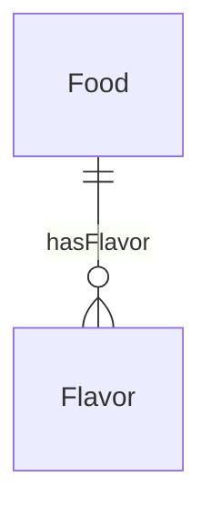


#### Attributes

| Name | Cardinality: | Type | Description |
| --- | --- | --- | --- |
| id | <sub>1..1</sub> | uri | A unique identifier |
| name | <sub>1..1</sub> | string | Human-readable label for the entity |
| description | <sub>0..1</sub> | string | A description of the entity |

#### Parents

 * [NamedIndividual](#NamedIndividual) - A Thing that requires a name

#### Referenced by:

 *  **[Food](#Food)** : *[hasFlavor](#hasFlavor)*  <sub>0..\*</sub> 


### Food


#### Attributes

| Name | Cardinality: | Type | Description |
| --- | --- | --- | --- |
| id | <sub>1..1</sub> | uri | A unique identifier |
| name | <sub>0..1</sub> | string | Human-readable label for the entity |
| description | <sub>0..1</sub> | string | A description of the entity |
| **firmness** | <sub>0..1</sub> | integer |  |
| **hasFlavor** | <sub>0..\*</sub> | [Flavor](#Flavor) | A Pokemon has a flavor |
| **smoothness** | <sub>0..1</sub> | integer |  |

#### Parents

 * [Item](#Item)

#### Children

 * [Berry](#Berry)

#### Referenced by:


### Game

A game is a type of media that can be played by people.


#### Local class diagram

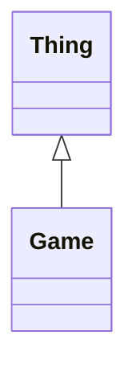

#### Attributes

| Name | Cardinality: | Type | Description |
| --- | --- | --- | --- |
| id | <sub>1..1</sub> | uri | A unique identifier |
| name | <sub>0..1</sub> | string | Human-readable label for the entity |
| description | <sub>0..1</sub> | string | A description of the entity |

#### Parents

 * [Thing](#Thing) - An rdfs:Resource that defines name and description


### Generation


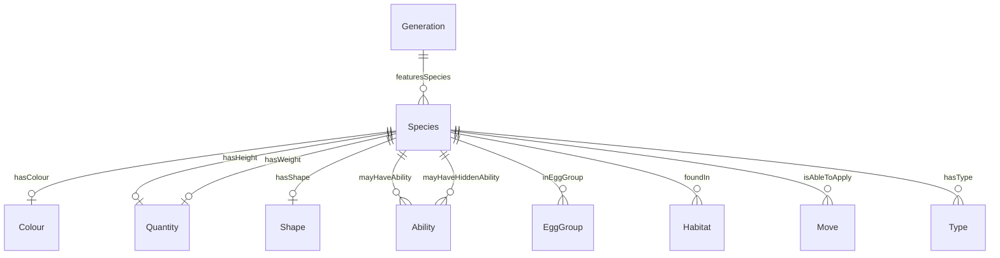


#### Attributes

| Name | Cardinality: | Type | Description |
| --- | --- | --- | --- |
| id | <sub>1..1</sub> | uri | A unique identifier |
| name | <sub>0..1</sub> | string | Human-readable label for the entity |
| description | <sub>0..1</sub> | string | A description of the entity |
| **featuresSpecies** | <sub>0..\*</sub> | [Species](#Species) | ['A Pokedex entry features a species'] |

#### Parents

 * [Thing](#Thing) - An rdfs:Resource that defines name and description


### Gym

A gym is a location that can be battled at.


#### Local class diagram

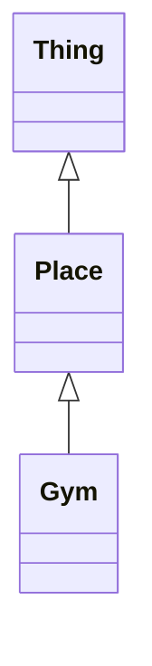

#### Attributes

| Name | Cardinality: | Type | Description |
| --- | --- | --- | --- |
| id | <sub>1..1</sub> | uri | A unique identifier |
| name | <sub>0..1</sub> | string | Human-readable label for the entity |
| description | <sub>0..1</sub> | string | A description of the entity |

#### Parents

 * [Place](#Place)


### GymLeader


#### Local class diagram

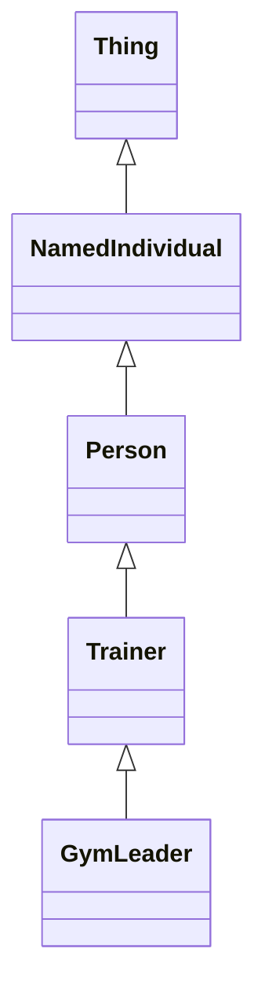

#### Attributes

| Name | Cardinality: | Type | Description |
| --- | --- | --- | --- |
| id | <sub>1..1</sub> | uri | A unique identifier |
| name | <sub>1..1</sub> | string | Human-readable label for the entity |
| description | <sub>0..1</sub> | string | A description of the entity |
| depiction | <sub>0..1</sub> | string | A depiction of the person |

#### Parents

 * [Trainer](#Trainer) - A trainer is a person who is able to catch Pokemon.


### HM

Hidden Machine


#### Local class diagram

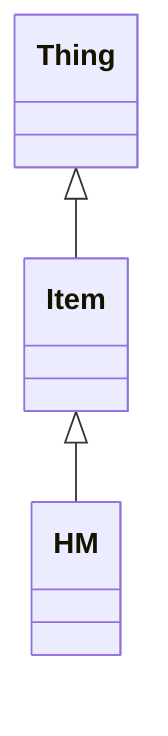

#### Attributes

| Name | Cardinality: | Type | Description |
| --- | --- | --- | --- |
| id | <sub>1..1</sub> | uri | A unique identifier |
| name | <sub>0..1</sub> | string | Human-readable label for the entity |
| description | <sub>0..1</sub> | string | A description of the entity |

#### Parents

 * [Item](#Item)


### Habitat

A habitat is a type of environment that certain Pokemon belong to.

```mermaid
erDiagram
Habitat {

}
Species {

}

Species ||--|o Colour : "hasColour"
Species ||--|o Quantity : "hasHeight"
Species ||--|o Quantity : "hasWeight"
Species ||--|o Shape : "hasShape"
Species ||--}o Ability : "mayHaveAbility"
Species ||--}o Ability : "mayHaveHiddenAbility"
Species ||--}o EggGroup : "inEggGroup"
Species ||--}o Habitat : "foundIn"
Species ||--}o Move : "isAbleToApply"
Species ||--}o Type : "hasType"

```


#### Attributes

| Name | Cardinality: | Type | Description |
| --- | --- | --- | --- |
| id | <sub>1..1</sub> | uri | A unique identifier |
| name | <sub>1..1</sub> | string | Human-readable label for the entity |
| description | <sub>0..1</sub> | string | A description of the entity |

#### Parents

 * [NamedIndividual](#NamedIndividual) - A Thing that requires a name

#### Referenced by:

 *  **[Species](#Species)** : *[foundIn](#foundIn)*  <sub>0..\*</sub> 


### HoldItem

A hold item is an item that can be held by a Pokemon.


#### Local class diagram

```mermaid
classDiagram
Item <|-- HoldItem
Thing <|-- Item

```

#### Attributes

| Name | Cardinality: | Type | Description |
| --- | --- | --- | --- |
| id | <sub>1..1</sub> | uri | A unique identifier |
| name | <sub>0..1</sub> | string | Human-readable label for the entity |
| description | <sub>0..1</sub> | string | A description of the entity |

#### Parents

 * [Item](#Item)


### Item


#### Local class diagram

```mermaid
classDiagram
Item <|-- BattleItem
Item <|-- Food
Item <|-- HM
Item <|-- HoldItem
Item <|-- Medicine
Item <|-- Pokeball
Item <|-- TM
Thing <|-- Item

```

#### Attributes

| Name | Cardinality: | Type | Description |
| --- | --- | --- | --- |
| id | <sub>1..1</sub> | uri | A unique identifier |
| name | <sub>0..1</sub> | string | Human-readable label for the entity |
| description | <sub>0..1</sub> | string | A description of the entity |

#### Parents

 * [Thing](#Thing) - An rdfs:Resource that defines name and description

#### Children

 * [BattleItem](#BattleItem) - Battle items are items that can be used during battles.
 * [Food](#Food)
 * [HM](#HM) - Hidden Machine
 * [HoldItem](#HoldItem) - A hold item is an item that can be held by a Pokemon.
 * [Medicine](#Medicine) - Medicine items can heal various afflictions of a Pokemon.
 * [Pokeball](#Pokeball)
 * [TM](#TM)


### LearningByLevelingUp

A move that is learned by leveling up.


#### Local class diagram

```mermaid
classDiagram
MoveLearning <|-- LearningByLevelingUp

```

This class has no attributes


#### Parents

 * [MoveLearning](#MoveLearning) - A move learning is a way that a Pokemon can learn a move.


### LearningThroughBreeding

A move that is learned by breeding.


#### Local class diagram

```mermaid
classDiagram
MoveLearning <|-- LearningThroughBreeding

```

This class has no attributes


#### Parents

 * [MoveLearning](#MoveLearning) - A move learning is a way that a Pokemon can learn a move.


### Medicine

Medicine items can heal various afflictions of a Pokemon.


#### Local class diagram

```mermaid
classDiagram
Item <|-- Medicine
Thing <|-- Item

```

#### Attributes

| Name | Cardinality: | Type | Description |
| --- | --- | --- | --- |
| id | <sub>1..1</sub> | uri | A unique identifier |
| name | <sub>0..1</sub> | string | Human-readable label for the entity |
| description | <sub>0..1</sub> | string | A description of the entity |

#### Parents

 * [Item](#Item)


### Move


```mermaid
erDiagram
Move {

}
Species {

}
Type {

}

Move ||--}o Type : "hasType"
Species ||--|o Colour : "hasColour"
Species ||--|o Quantity : "hasHeight"
Species ||--|o Quantity : "hasWeight"
Species ||--|o Shape : "hasShape"
Species ||--}o Ability : "mayHaveAbility"
Species ||--}o Ability : "mayHaveHiddenAbility"
Species ||--}o EggGroup : "inEggGroup"
Species ||--}o Habitat : "foundIn"
Species ||--}o Move : "isAbleToApply"
Species ||--}o Type : "hasType"

```


#### Attributes

| Name | Cardinality: | Type | Description |
| --- | --- | --- | --- |
| id | <sub>1..1</sub> | uri | A unique identifier |
| name | <sub>0..1</sub> | string | Human-readable label for the entity |
| description | <sub>0..1</sub> | string | A description of the entity |
| **effectDescription** | <sub>0..\*</sub> | string | A description of the effect of the entity |
| **hasType** | <sub>0..\*</sub> | [Type](#Type) | A Pokemon has a type |

#### Parents

 * [Thing](#Thing) - An rdfs:Resource that defines name and description

#### Children

 * [PhysicalMove](#PhysicalMove) - A physical move is a type of move that can be used during battles.
 * [SpecialMove](#SpecialMove) - A special move is a type of move that can be used during battles.
 * [StatusMove](#StatusMove) - A status move is a type of move that can be used during battles.

#### Referenced by:

 *  **[Species](#Species)** : *[isAbleToApply](#isAbleToApply)*  <sub>0..\*</sub> 


### MoveLearning

A move learning is a way that a Pokemon can learn a move.


#### Local class diagram

```mermaid
classDiagram
MoveLearning <|-- LearningByLevelingUp
MoveLearning <|-- LearningThroughBreeding

```

This class has no attributes


#### Children

 * [LearningByLevelingUp](#LearningByLevelingUp) - A move that is learned by leveling up.
 * [LearningThroughBreeding](#LearningThroughBreeding) - A move that is learned by breeding.

#### Used as mixin by

 * [TM](#TM)

#### Referenced by:


### Person

A person is a human being


#### Local class diagram

```mermaid
classDiagram
NamedIndividual <|-- Person
Person <|-- Trainer
Thing <|-- NamedIndividual

```

#### Attributes

| Name | Cardinality: | Type | Description |
| --- | --- | --- | --- |
| id | <sub>1..1</sub> | uri | A unique identifier |
| name | <sub>1..1</sub> | string | Human-readable label for the entity |
| description | <sub>0..1</sub> | string | A description of the entity |
| **depiction** | <sub>0..1</sub> | string | A depiction of the person |

#### Parents

 * [NamedIndividual](#NamedIndividual) - A Thing that requires a name

#### Children

 * [Trainer](#Trainer) - A trainer is a person who is able to catch Pokemon.


### PhysicalMove

A physical move is a type of move that can be used during battles.

```mermaid
erDiagram
PhysicalMove {

}
Type {

}

PhysicalMove ||--}o Type : "hasType"

```


#### Attributes

| Name | Cardinality: | Type | Description |
| --- | --- | --- | --- |
| id | <sub>1..1</sub> | uri | A unique identifier |
| name | <sub>0..1</sub> | string | Human-readable label for the entity |
| description | <sub>0..1</sub> | string | A description of the entity |
| effectDescription | <sub>0..\*</sub> | string | A description of the effect of the entity |
| hasType | <sub>0..\*</sub> | [Type](#Type) | A Pokemon has a type |

#### Parents

 * [Move](#Move)


### Pokeball


#### Local class diagram

```mermaid
classDiagram
Item <|-- Pokeball
Thing <|-- Item

```

#### Attributes

| Name | Cardinality: | Type | Description |
| --- | --- | --- | --- |
| id | <sub>1..1</sub> | uri | A unique identifier |
| name | <sub>0..1</sub> | string | Human-readable label for the entity |
| description | <sub>0..1</sub> | string | A description of the entity |

#### Parents

 * [Item](#Item)


### Pokedex


#### Local class diagram

```mermaid
classDiagram
Thing <|-- Pokedex

```

#### Attributes

| Name | Cardinality: | Type | Description |
| --- | --- | --- | --- |
| id | <sub>1..1</sub> | uri | A unique identifier |
| name | <sub>0..1</sub> | string | Human-readable label for the entity |
| description | <sub>0..1</sub> | string | A description of the entity |

#### Parents

 * [Thing](#Thing) - An rdfs:Resource that defines name and description

#### Referenced by:


### PokedexEntry

A pokedex entry is a description of a Pokemon.


#### Local class diagram

```mermaid
classDiagram
Thing <|-- PokedexEntry

```

#### Attributes

| Name | Cardinality: | Type | Description |
| --- | --- | --- | --- |
| id | <sub>1..1</sub> | uri | A unique identifier |
| name | <sub>0..1</sub> | string | Human-readable label for the entity |
| description | <sub>0..1</sub> | string | A description of the entity |

#### Parents

 * [Thing](#Thing) - An rdfs:Resource that defines name and description

#### Referenced by:


### Pokemon

A Pokemon


This class has no attributes


### Quantity

A physical quantity.

```mermaid
erDiagram
Quantity {

}
QuantityKind {

}
Species {

}
Unit {

}

Quantity ||--|o QuantityKind : "hasQuantityKind"
Quantity ||--}o Unit : "hasUnit"
Species ||--|o Colour : "hasColour"
Species ||--|o Quantity : "hasHeight"
Species ||--|o Quantity : "hasWeight"
Species ||--|o Shape : "hasShape"
Species ||--}o Ability : "mayHaveAbility"
Species ||--}o Ability : "mayHaveHiddenAbility"
Species ||--}o EggGroup : "inEggGroup"
Species ||--}o Habitat : "foundIn"
Species ||--}o Move : "isAbleToApply"
Species ||--}o Type : "hasType"

```


#### Attributes

| Name | Cardinality: | Type | Description |
| --- | --- | --- | --- |
| id | <sub>1..1</sub> | uri | A unique identifier |
| name | <sub>0..1</sub> | string | Human-readable label for the entity |
| description | <sub>0..1</sub> | string | A description of the entity |
| **hasQuantityKind** | <sub>0..1</sub> | [QuantityKind](#QuantityKind) | The kind of quantity (e.g., Length, Mass, Time). |
| **hasUnit** | <sub>0..\*</sub> | [Unit](#Unit) |  |
| **hasValue** | <sub>0..1</sub> | string | The numeric value of the quantity. |

#### Parents

 * [Thing](#Thing) - An rdfs:Resource that defines name and description

#### Referenced by:

 *  **[Species](#Species)** : *[hasHeight](#hasHeight)*  <sub>0..1</sub> 
 *  **[Species](#Species)** : *[hasWeight](#hasWeight)*  <sub>0..1</sub> 


### QuantityKind


```mermaid
erDiagram
Quantity {

}
QuantityKind {

}

Quantity ||--|o QuantityKind : "hasQuantityKind"
Quantity ||--}o Unit : "hasUnit"

```


This class has no attributes


#### Referenced by:

 *  **[Quantity](#Quantity)** : *[Quantity_hasQuantityKind](#Quantity_hasQuantityKind)*  <sub>0..1</sub> 


### Region


#### Local class diagram

```mermaid
classDiagram
Place <|-- Region
Thing <|-- Place

```

#### Attributes

| Name | Cardinality: | Type | Description |
| --- | --- | --- | --- |
| id | <sub>1..1</sub> | uri | A unique identifier |
| name | <sub>0..1</sub> | string | Human-readable label for the entity |
| description | <sub>0..1</sub> | string | A description of the entity |

#### Parents

 * [Place](#Place)


### Shape

Shapes are categories that certain Pokemon belong to, which determine which Pokemon they can breed with.

```mermaid
erDiagram
Shape {

}
Species {

}

Species ||--|o Colour : "hasColour"
Species ||--|o Quantity : "hasHeight"
Species ||--|o Quantity : "hasWeight"
Species ||--|o Shape : "hasShape"
Species ||--}o Ability : "mayHaveAbility"
Species ||--}o Ability : "mayHaveHiddenAbility"
Species ||--}o EggGroup : "inEggGroup"
Species ||--}o Habitat : "foundIn"
Species ||--}o Move : "isAbleToApply"
Species ||--}o Type : "hasType"

```


#### Attributes

| Name | Cardinality: | Type | Description |
| --- | --- | --- | --- |
| id | <sub>1..1</sub> | uri | A unique identifier |
| name | <sub>1..1</sub> | string | Human-readable label for the entity |
| description | <sub>0..1</sub> | string | A description of the entity |

#### Parents

 * [NamedIndividual](#NamedIndividual) - A Thing that requires a name

#### Referenced by:

 *  **[Species](#Species)** : *[hasShape](#hasShape)*  <sub>0..1</sub> 


### SpecialMove

A special move is a type of move that can be used during battles.

```mermaid
erDiagram
SpecialMove {

}
Type {

}

SpecialMove ||--}o Type : "hasType"

```


#### Attributes

| Name | Cardinality: | Type | Description |
| --- | --- | --- | --- |
| id | <sub>1..1</sub> | uri | A unique identifier |
| name | <sub>0..1</sub> | string | Human-readable label for the entity |
| description | <sub>0..1</sub> | string | A description of the entity |
| effectDescription | <sub>0..\*</sub> | string | A description of the effect of the entity |
| hasType | <sub>0..\*</sub> | [Type](#Type) | A Pokemon has a type |

#### Parents

 * [Move](#Move)


### Species

A species is a category of Pokemon that share common features.

```mermaid
erDiagram
Ability {

}
Colour {

}
EggGroup {

}
Generation {

}
Habitat {

}
Move {

}
Quantity {

}
Shape {

}
Species {

}
Type {

}

Generation ||--}o Species : "featuresSpecies"
Move ||--}o Type : "hasType"
Quantity ||--|o QuantityKind : "hasQuantityKind"
Quantity ||--}o Unit : "hasUnit"
Species ||--|o Colour : "hasColour"
Species ||--|o Quantity : "hasHeight"
Species ||--|o Quantity : "hasWeight"
Species ||--|o Shape : "hasShape"
Species ||--}o Ability : "mayHaveAbility"
Species ||--}o Ability : "mayHaveHiddenAbility"
Species ||--}o EggGroup : "inEggGroup"
Species ||--}o Habitat : "foundIn"
Species ||--}o Move : "isAbleToApply"
Species ||--}o Type : "hasType"

```


#### Attributes

| Name | Cardinality: | Type | Description |
| --- | --- | --- | --- |
| id | <sub>1..1</sub> | uri | A unique identifier |
| name | <sub>1..1</sub> | string | Human-readable label for the entity |
| description | <sub>0..1</sub> | string | A description of the entity |
| **depiction** | <sub>0..1</sub> | string | A depiction of the person |
| **foundIn** | <sub>0..\*</sub> | [Habitat](#Habitat) | A place is found in a location |
| **hasCatchRate** | <sub>0..1</sub> | integer |  |
| **hasColour** | <sub>0..1</sub> | [Colour](#Colour) | A Pokemon has a color |
| **hasGenus** | <sub>0..1</sub> | string |  |
| **hasHeight** | <sub>0..1</sub> | [Quantity](#Quantity) |  |
| **hasShape** | <sub>0..1</sub> | [Shape](#Shape) | The shape of a berry is a measure of how good it is for making a Potion. |
| **hasType** | <sub>0..\*</sub> | [Type](#Type) | A Pokemon has a type |
| **hasWeight** | <sub>0..1</sub> | [Quantity](#Quantity) |  |
| **inEggGroup** | <sub>0..\*</sub> | [EggGroup](#EggGroup) |  |
| **isAbleToApply** | <sub>0..\*</sub> | [Move](#Move) |  |
| **mayHaveAbility** | <sub>0..\*</sub> | [Ability](#Ability) | A Pokemon may have an ability |
| **mayHaveHiddenAbility** | <sub>0..\*</sub> | [Ability](#Ability) |  |

#### Parents

 * [NamedIndividual](#NamedIndividual) - A Thing that requires a name

#### Referenced by:

 *  **[Generation](#Generation)** : *[featuresSpecies](#featuresSpecies)*  <sub>0..\*</sub> 


### StatusMove

A status move is a type of move that can be used during battles.

```mermaid
erDiagram
StatusMove {

}
Type {

}

StatusMove ||--}o Type : "hasType"

```


#### Attributes

| Name | Cardinality: | Type | Description |
| --- | --- | --- | --- |
| id | <sub>1..1</sub> | uri | A unique identifier |
| name | <sub>0..1</sub> | string | Human-readable label for the entity |
| description | <sub>0..1</sub> | string | A description of the entity |
| effectDescription | <sub>0..\*</sub> | string | A description of the effect of the entity |
| hasType | <sub>0..\*</sub> | [Type](#Type) | A Pokemon has a type |

#### Parents

 * [Move](#Move)


### TM


#### Local class diagram

```mermaid
classDiagram
Item <|-- TM
Thing <|-- Item
TM ..> MoveLearning

```

#### Attributes

| Name | Cardinality: | Type | Description |
| --- | --- | --- | --- |
| id | <sub>1..1</sub> | uri | A unique identifier |
| name | <sub>0..1</sub> | string | Human-readable label for the entity |
| description | <sub>0..1</sub> | string | A description of the entity |

#### Parents

 * [Item](#Item)

#### Uses

 *  mixin: [MoveLearning](#MoveLearning) - A move learning is a way that a Pokemon can learn a move.


### Town

A town is a type of place that can be visited.


#### Local class diagram

```mermaid
classDiagram
Place <|-- Town
Thing <|-- Place

```

#### Attributes

| Name | Cardinality: | Type | Description |
| --- | --- | --- | --- |
| id | <sub>1..1</sub> | uri | A unique identifier |
| name | <sub>0..1</sub> | string | Human-readable label for the entity |
| description | <sub>0..1</sub> | string | A description of the entity |

#### Parents

 * [Place](#Place)


### Trainer

A trainer is a person who is able to catch Pokemon.


#### Local class diagram

```mermaid
classDiagram
NamedIndividual <|-- Person
Person <|-- Trainer
Thing <|-- NamedIndividual
Trainer <|-- GymLeader

```

#### Attributes

| Name | Cardinality: | Type | Description |
| --- | --- | --- | --- |
| id | <sub>1..1</sub> | uri | A unique identifier |
| name | <sub>1..1</sub> | string | Human-readable label for the entity |
| description | <sub>0..1</sub> | string | A description of the entity |
| depiction | <sub>0..1</sub> | string | A depiction of the person |

#### Parents

 * [Person](#Person) - A person is a human being

#### Children

 * [GymLeader](#GymLeader)


### Type


```mermaid
erDiagram
Move {

}
Species {

}
Type {

}

Move ||--}o Type : "hasType"
Species ||--|o Colour : "hasColour"
Species ||--|o Quantity : "hasHeight"
Species ||--|o Quantity : "hasWeight"
Species ||--|o Shape : "hasShape"
Species ||--}o Ability : "mayHaveAbility"
Species ||--}o Ability : "mayHaveHiddenAbility"
Species ||--}o EggGroup : "inEggGroup"
Species ||--}o Habitat : "foundIn"
Species ||--}o Move : "isAbleToApply"
Species ||--}o Type : "hasType"

```


#### Attributes

| Name | Cardinality: | Type | Description |
| --- | --- | --- | --- |
| id | <sub>1..1</sub> | uri | A unique identifier |
| name | <sub>1..1</sub> | string | Human-readable label for the entity |
| description | <sub>0..1</sub> | string | A description of the entity |

#### Parents

 * [NamedIndividual](#NamedIndividual) - A Thing that requires a name

#### Referenced by:

 *  **[Move](#Move)** : *[hasType](#hasType)*  <sub>0..\*</sub> 
 *  **[Species](#Species)** : *[hasType](#hasType)*  <sub>0..\*</sub> 


### Unit

A unit of measure.

```mermaid
erDiagram
Quantity {

}
Unit {

}

Quantity ||--|o QuantityKind : "hasQuantityKind"
Quantity ||--}o Unit : "hasUnit"

```


#### Attributes

| Name | Cardinality: | Type | Description |
| --- | --- | --- | --- |
| id | <sub>1..1</sub> | uri | A unique identifier |
| name | <sub>0..1</sub> | string | Human-readable label for the entity |
| description | <sub>0..1</sub> | string | A description of the entity |

#### Parents

 * [Thing](#Thing) - An rdfs:Resource that defines name and description

#### Referenced by:

 *  **[Quantity](#Quantity)** : *[hasUnit](#hasUnit)*  <sub>0..\*</sub> 


## Enums


### HabitatEnum


| Text | Meaning: | Description |
| --- | --- | --- |
| Cave | pokemon:Habitat_Cave |  |
| Forest | pokemon:Habitat_Forest |  |
| Grassland | pokemon:Habitat_Grassland |  |

